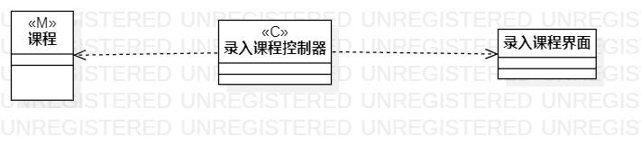
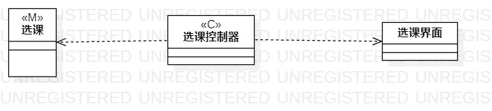
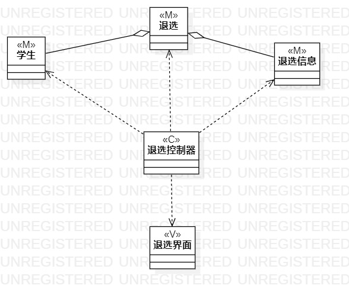

# 实验四和五 类建模和高级类建模

## 一、实验目标
### 1.掌握类建模方法；
### 2.了解MVC或你熟悉的设计模式；
### 3.掌握类图的画法。（Class Diagram）

## 二、实验内容
### 1.基于MVC模式设计类；
### 2.设计类的关系；
### 3.画出类图。

## 三、实验步骤
### 1.在用例规约中的基本流程和扩展流程中寻找类；
### 2.确定用例（录入课程信息，选课，退选），确定类图（录入课程信息，选课，退选）；
### 3.用StarUML画出用例图；
### 4.提交到GITHUB；

## 四、实验结果

