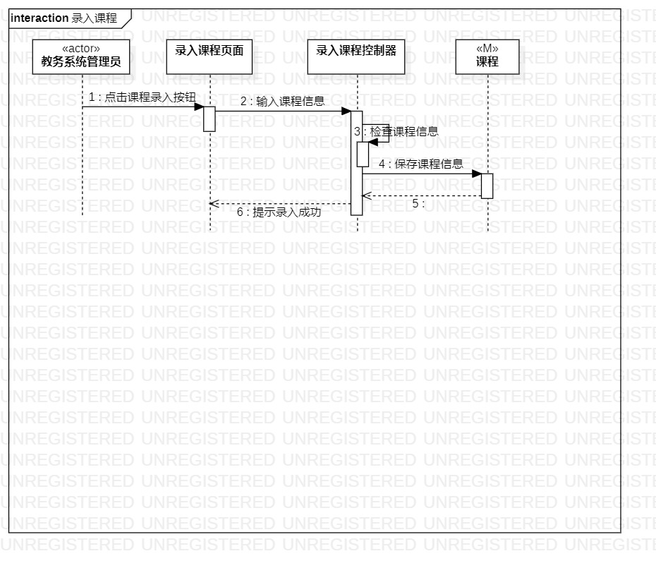
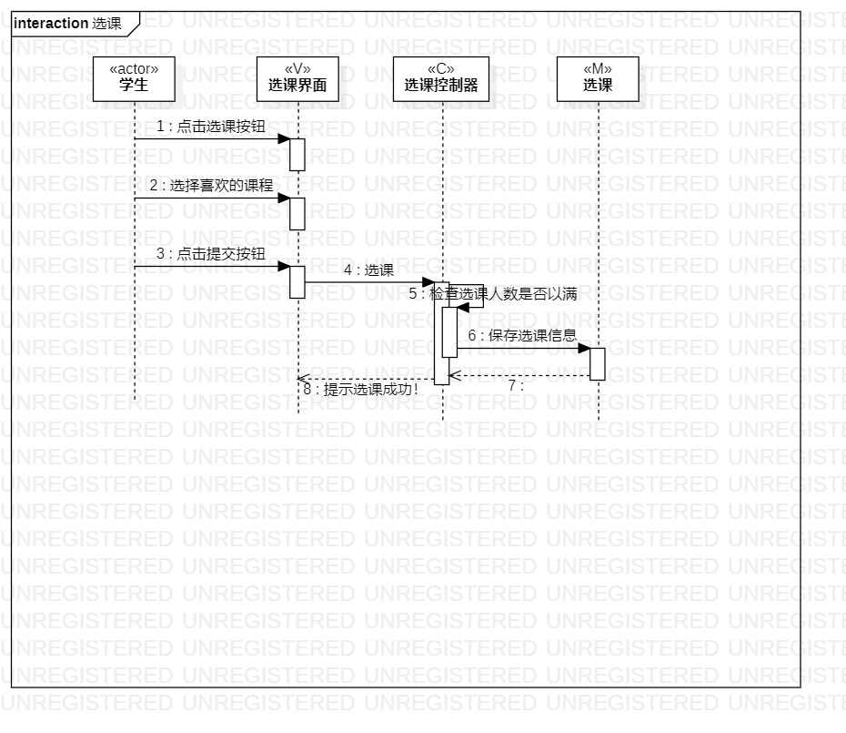
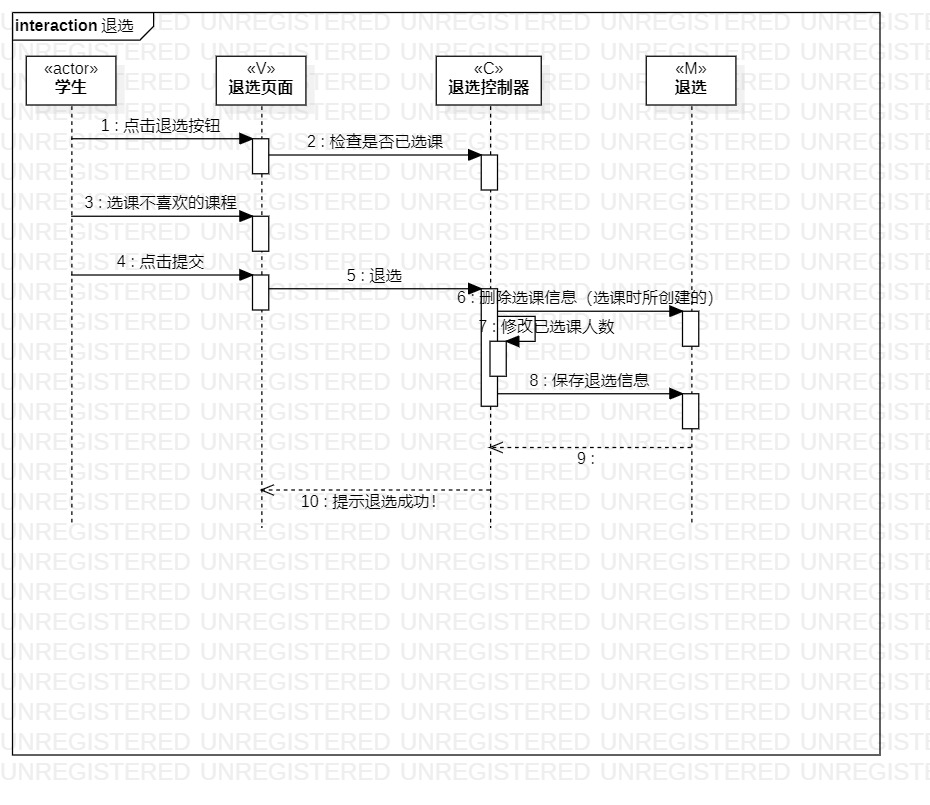

# 实验六 交互建模

## 一、实验目标
### 理解系统交互；
### 掌握UML顺序图的画法；
### 掌握对象交互的定义与建模方法。

## 二、实验内容
### 根据用例模型和类模型，确定功能所涉及的系统对象；
### 在顺序图上画出参与者（对象）；
### 在顺序图上画出消息（交互）。

## 三、实验步骤
### 1.在用例图找到参与者（教务管理员和学生）；
### 2.在类图找到参与者；
### 3.在活动图里找到操作步骤，思考他们与参与者的关系；
### 4.画出参与者之间的消息；

## 四、实验结果

### 1.录入课程的顺序图

### 2.选课的顺序图

### 3.退选的顺序图
