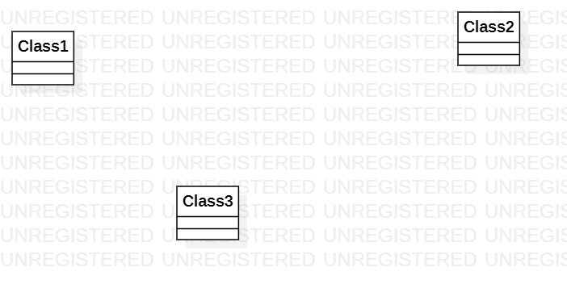

# 实验一

## 一、实验目标

1. 熟悉GitHub实验过程

2. 安装与使用StarUML

## 二、实验内容

- 练习使用GitHub和Git Bash
- 使用StarUML创建第一个UML图

## 三、实验步骤

1.下载并安装Git和StarUML

2.注册Github账号并登录

3.fork项目到仓库

4.使用git clone命令克隆项目到本地

5.在本地创建和编辑文件lab1.md

6.打开安装的StarUML并绘制第一个UML图model1.jpg

7.使用git add命令将学号目录下的文件提交到暂存区

8.使用git commit命令将暂存区文件提交到版本库

9.使用git push命令将到github本地版本库的分支推送到远程服务器

10.在Github上编辑lab1.md文档并插入图片model1.jpg

11.发送结果到主项目库(pull request)

## 四、实验结果

1. 画图

  
图1. 在StarUML上创建的第一个图
