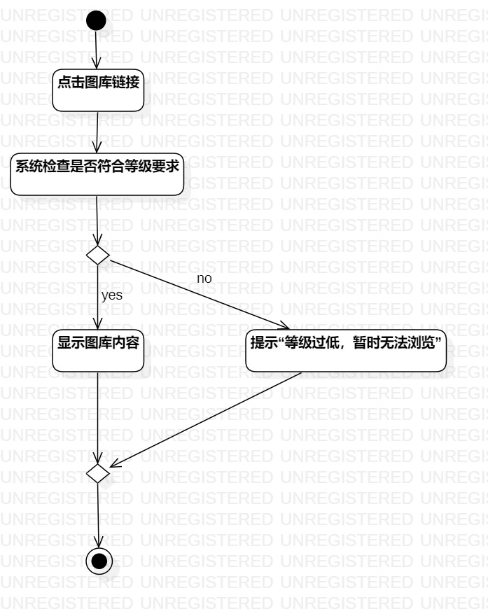
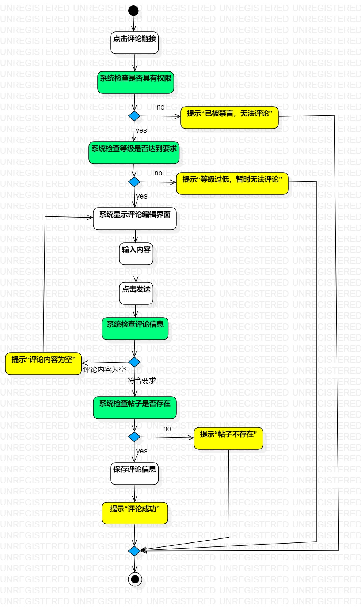

# 实验三：过程建模

## 一、实验目标

1. 掌握过程建模方法
2. 掌握活动图的画法（Activity Diagram）

## 二、实验内容

- 根据实验二中的用例规约绘制活动图

## 三、实验步骤

1. 创建浏览图库、评论帖子的活动图
2. 添加Iniial（开始节点）和Final（终止节点）
3. 根据用例规约添加Action（动作状态）
4. 扩展流程处先使用Decision（分支），然后Merge（合并）
5. 用Control Flow（控制流）连接
6. 调整位置直至不交叉且整洁
7. 导出并上传活动图

## 四、实验结果

图一：浏览图库的活动图

图二：评论帖子的活动图
