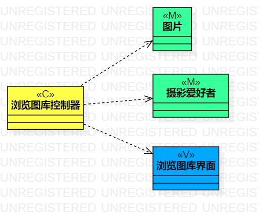
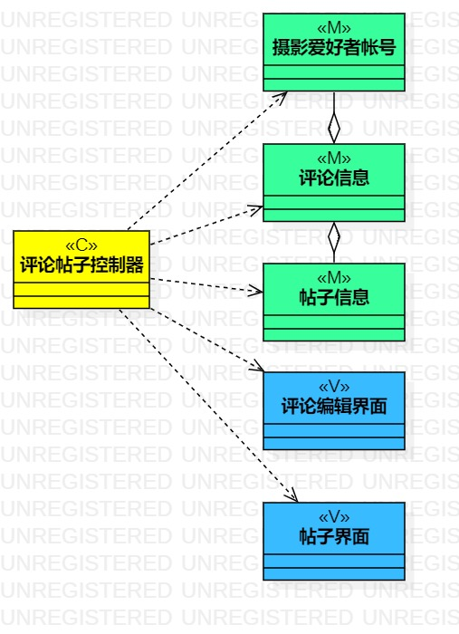

# 实验四：类建模 & 实验五: 高级类建模

## 一、实验目标

### 1. 掌握类建模方法；
### 2. 了解MVC或你熟悉的设计模式；
### 3. 掌握类图的画法。（Class Diagram）

## 二、实验内容  

### 1. 学习类建模
### 2. 根据用例规约找出类对象，并且对类建模；

## 三、 实验步骤

### 1.学习了解类建模、MVC模式
### 2.根据MVC模式和用例规约，确定各层包含哪些类
### 3.确定类之间的关系
### 4.使用StarUML画出类图

## 四、实验结果

图1：浏览图库类图

图2：评论帖子类图

## 五、实验总结
### 1.MVC模式：
- Model层：表示数据和业务规则
- View层：与用户交互的界面
- Controller层：负责Model和View层之间的通信
### 2.类
一般包含3个组成部分
- 类名
- 属性（attributes）
- 方法
### 3.类的关系
- 依赖
- 关联
- 聚合
- 组合
- 继承
