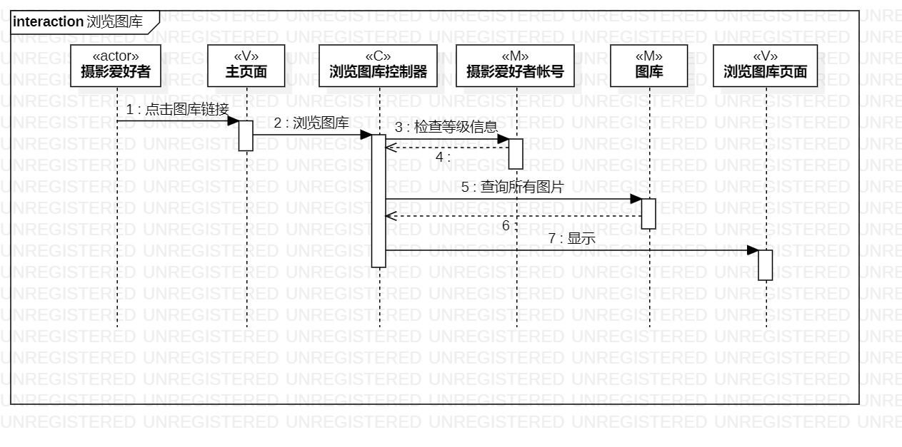
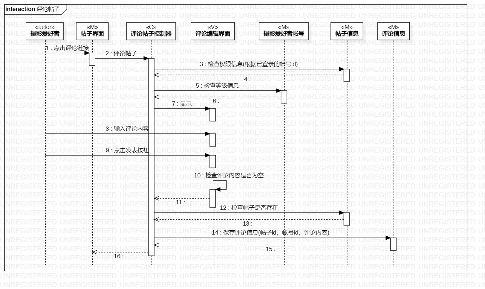

# 实验六：交互建模

## 一、实验目标

1. 理解系统交互的概念。 

2. 掌握UML顺序图的画法。 

3. 掌握对象交互的定义与建模方法。

## 二、实验内容

1. 根据活动图和类图，确定功能所涉及的系统对象。  

2. 在顺序图上画出参与者。  

3. 在顺序图上画出消息。 

## 三、实验步骤

1. 从实验二的用例图中找到参与者（摄影爱好者）并画出（Lifeline）

2. 从实验四、五的类图中找到其余参与者（MVC）并画出（Lifeline）

3. 根据实验三活动图确定参与者之间的消息并画出（Message）

## 四、实验结果

  

图1：浏览图库顺序图

  

图2：评论帖子顺序图