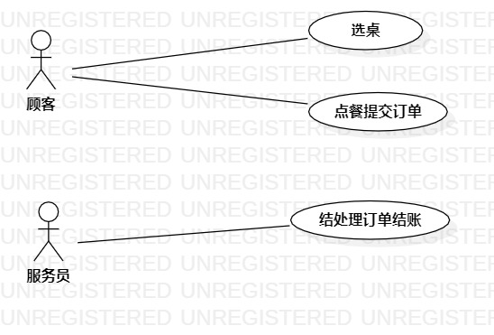

# 实验二：用例建模

## 1. 实验目标

1.创建并完善选题

2.了解并掌握用例图的画法

3.通过github提交实验文档

## 3. 实验步骤

1. 选题为餐馆点餐系统  
  - 功能：
    - 客户选桌
    - 客户点餐提交订单
    - 服务员处理订单结账
2. 根据issues在StarUML上创建用例创建用例图     
 - 确定参与者（Actor）：
    - 客户
    - 服务员  
 - 确定用例（UserCase）：
    - 选桌
    - 点餐提交订单
    - 处理订单结账  
 - 建立Actor和UserCase之间的联系
3. 编写用例规约

## 4. 实验结果

- 画图  

图1：餐馆点餐系统的用例图

## 表1：选桌用例规约  

用例编号  | UC01 | 备注  
-|:-|-  
用例名称  | 选桌  |   
前置条件  |  客户进入点餐系统页面   | *可选*   
后置条件  | 客户进入点餐页面     | *可选*   
基本流程  | 1. 客户点击选卓按钮；  |*用例执行成功的步骤*    
~| 2. 系统显示桌位；  |   
~| 3. 客户点击选择的桌位  |  
~| 4. 系统查询桌位信息，检查桌位状态是否为“空闲”  | 
~| 5. 桌位状态为“空闲”，系统进入点餐页面，系统修改桌位状态为“正在使用”，保存桌位信息并写入点餐页面 |   
 
扩展流程  | 4.1 系统检查发现桌位状态为“正在使用”，提示顾客“该桌位正在使用，请选择其他桌位”。 |*用例执行失败*    

## 表2：点餐提交订单用例规约  

用例编号  | UC02 | 备注  
-|:-|-  
用例名称  | 点餐提交订单  |   
前置条件  |  客户进入点餐页面   | *可选*   
后置条件  |  显示提交成功页面  | *可选*   
基本流程  | 1. 顾客点击选择的菜品；  |*用例执行成功的步骤*    
~| 2. 系统显示菜品信息以及添加数量框；  |   
~| 3. 客户填写菜品添加的数量并点击确定按钮 | 
~| 4. 系统查询菜品信息，检查客户所选菜品库存是否满足需求，若满足需求，系统保存客户添加的菜品数量以及价格信息 |
~| 5. 客户点击提交订单按钮提交菜品订单  | 
~| 6. 系统保存客户的桌位信息以及所对应的菜品订单信息  |   
~| 7. 系统显示提交成功页面  |  
扩展流程  | 4.1 系统检查发现菜品库存不足以满足选择数量，提示客户“菜品库存不足”；  |*用例执行失败*    

## 表3：处理订单结账用例规约  

用例编号  | UC03 | 备注  
-|:-|-  
用例名称  |  处理订单结账  |   
前置条件  |  服务员进入处理订单页面   | *可选*   
后置条件  |  系统打印出订单结果  | *可选*   
基本流程  | 1. 服务员点击客户选择的桌号；  |*用例执行成功的步骤*    
~| 2. 系统查询桌号对应的状态为“待处理”的订单信息，显示订单信息；  |   
~| 3. 服务员点击结账按钮  |  
~| 4. 系统更新桌位状态为“空闲”并更新桌位对应的订单信息为“已处理”，打印出订单结果 |  

扩展流程  | 4.1 系统检查发现桌位状态为“空闲”，提示服务员“此桌空闲，没有订单需要处理”。  |*用例执行失败* 

