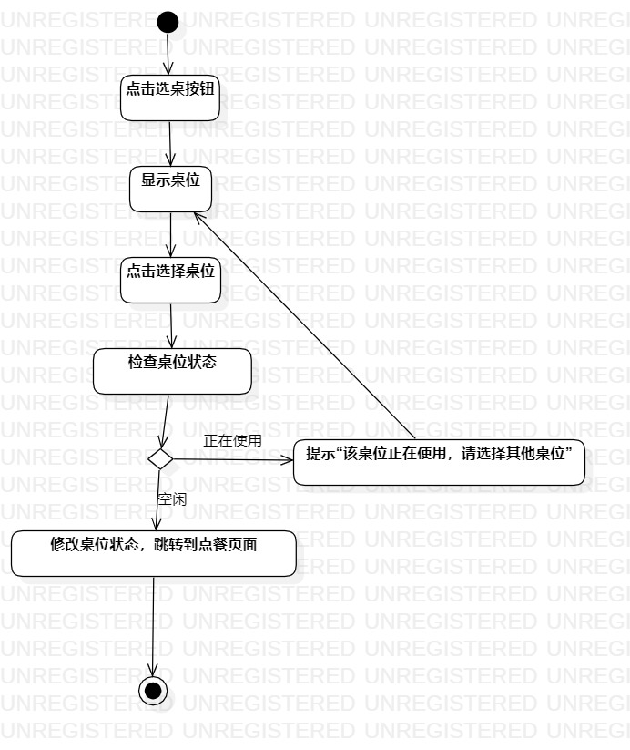
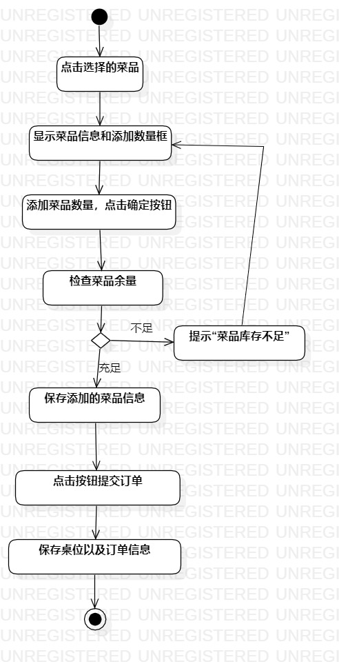
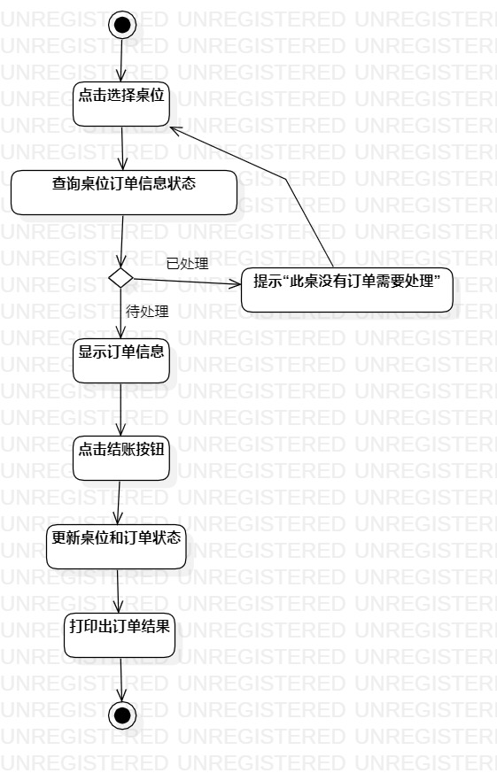

# 实验三：过程建模

## 一、实验目标
1. 掌握过程建模方法；
2. 掌握活动图的画法。（Activity Diagram）
## 二、实验内容
1. 使用StarUML根据lab2中编写的用例规约画活动图
## 三、实验步骤
1. 新建活动图（Add Diagram -> Activity Diagram）
2. 按照实验二用例图，绘制“选桌”、“提交订单”、“处理订单”三个用例的活动图；
3. 将绘制的活动图导出为.jpg图片；
4. 编写报告并提交。
## 四、实验结果

  
图1：选桌的活动图

  
图2：提交订单的活动图

  
图3：处理订单的活动图
