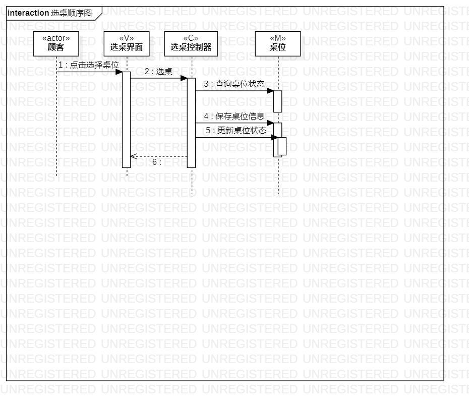
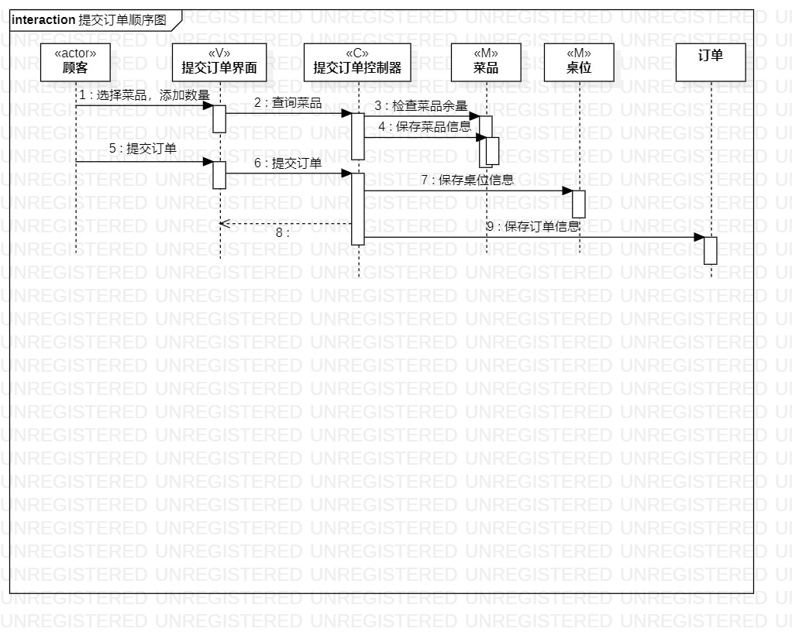
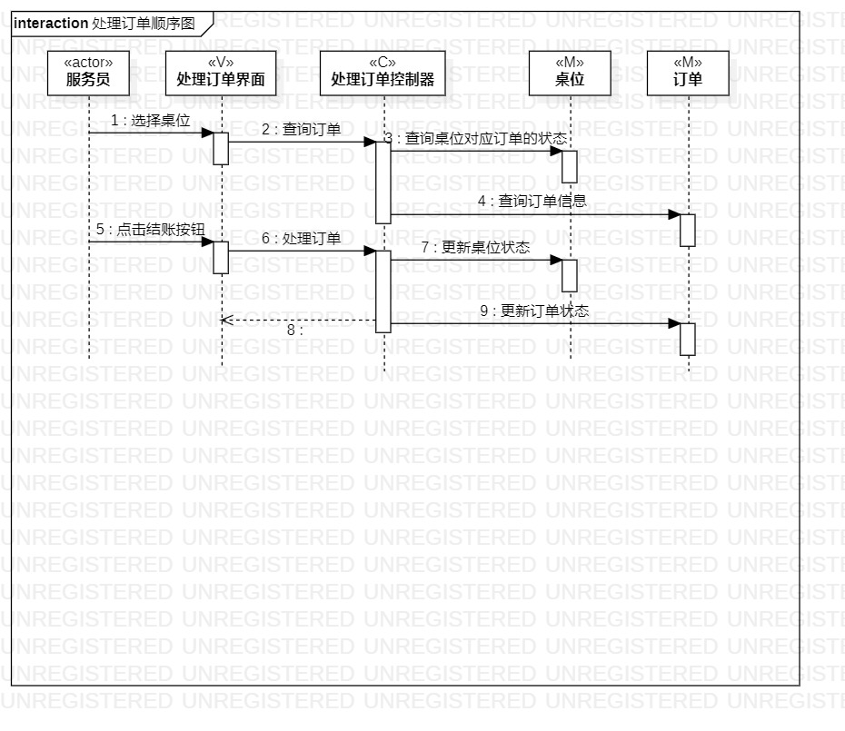

# 实验六：对象交互建模

## 一、实验目标 

1. 理解系统交互
2. 了解交互建模和顺序图概念
3. 掌握UML顺序图的画法
4. 掌握交互建模方法

## 二.实验内容

1. 学习交互建模和顺序图概念
   - 对象
   - 顺序图
2. 学习顺序图画法
3. 画用例1顺序图
4. 画用例2顺序图
5. 画用例3顺序图

## 三、实验步骤

1. 根据用例模型和类模型，确定功能所涉及的系统对象
2. 打开StarUML model新建Sequence diagram
3. StarUML画顺序图
   - 按对象添加Lifeline
   - 按活动图添加Message
   - 建立Reply Message
   
4. git push到个人库
5. 写lab6.md

## 四、实验结果
  
图1：选桌顺序图  

  
图2：提交订单顺序图  

  
图3：处理订单顺序图  
