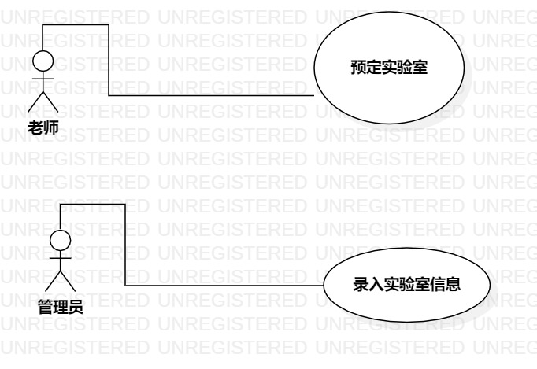

# 实验二：用例建模

## 1.实验目标
1.细化功能需求。

2.画出用例图（Use Case Diagram）。

3.编写用例规约（表格）。

## 2.实验内容
1.给每一个功能点写一段描述（字数至少60字，3行）。

2.写清楚使用功能的用户。

3.说明该功能执行之后产生的结果。

4.用例规约必填：基本流程（成功执行用例的步骤）；扩展流程（引起用例失败的步骤）。

## 3.实验步骤
1. 决定命题  
2. 空实验室预订系统 
    使用功能的用户：  
    老师和学生  
    功能：  
    2.1 用户可以预定实验室  
    2.2 管理员可以添加，删除空余实验室的信息
    实现后的效果：  
    每天可以通过预定来使用实验室，不用因为时间冲突耽误实验的进行  
3. 将命题使用StarUML画一个示例图  
    3.1 用ACTOR创建用户和管理员  
    3.2 再用椭圆创建两个功能  
    3.3 最后用线将他们连接在一起  
4. 给命题写用例规约  
    4.1 关于管理员将当天信息填入的用例规约  
    4.2 关于用户选择空实验室的用例规约  

## 3.实验结果
1. 画图  
  
图二 在StarUML创建的第二个图

2.用例规约：

## 表1：管理员填入实验室信息用例规约  

用例编号  | lwb01 | 备注  
-|:-|-  
用例名称  | 录入信息  |   
前置条件  | 管理员登录系统    | *可选*   
后置条件  |      | *可选*   
基本流程  | 1. 管理员点击修改按钮；  |*用例执行成功的步骤*    
~| 2. 系统显示修改页面；  |   
~| 3. 管理员添加实验室编号和使用时间段，点击完成按钮；  |   
~| 4. 系统保存实验室编号和使用时间段  |   
~| 5.   |  
扩展流程  | 3.1 系统检查发现管理员添加实验室编号和使用时间段不符合规范，**提示“输入不正确”**；  |*用例执行失败*    
~|  |  

## 表2：用户选择空实验室用例规约  

用例编号  | lwb02 | 备注  
-|:-|-  
用例名称  | 预定实验室  |   
前置条件  | 用户登录系统    | *可选*   
后置条件  |      | *可选*   
基本流程  | 1. 系统显示实验室编号和使用时间段；  |*用例执行成功的步骤*    
~| 2. 用户点击空实验链接，进入选择页面，选择时间段，点击选择；  |   
~| 3. 系统检查实验室编号和时间段相匹配和实验室没有被预定,系统标记实验被预定；  |   
~| 4. 系统显示“预定成功”，系统返回首页  |   
~| 5.   |  
扩展流程  | 3.1 系统检查实验室有被预定，**提示“实验室已经被预定”**；  |*用例执行失败*    
~|  |  

