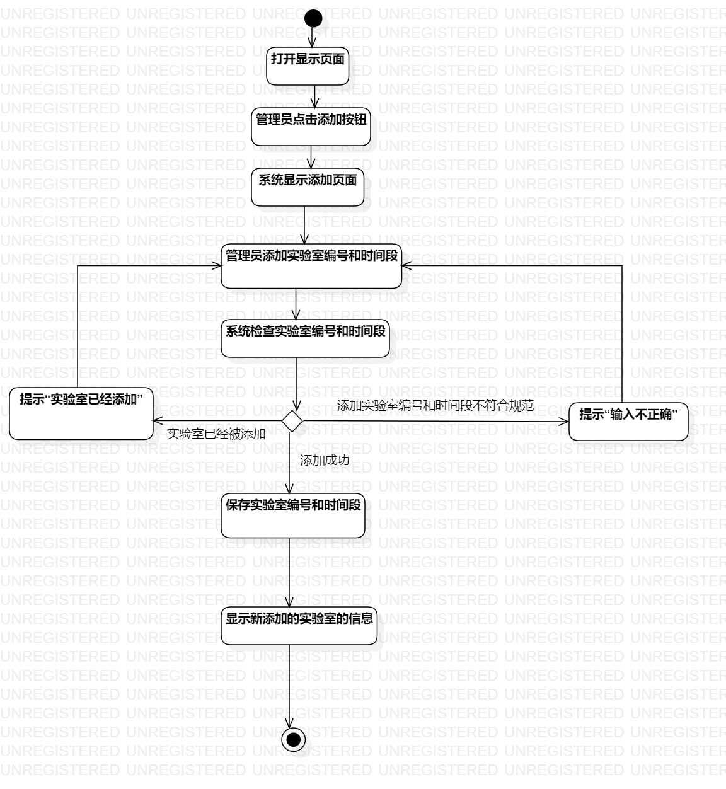
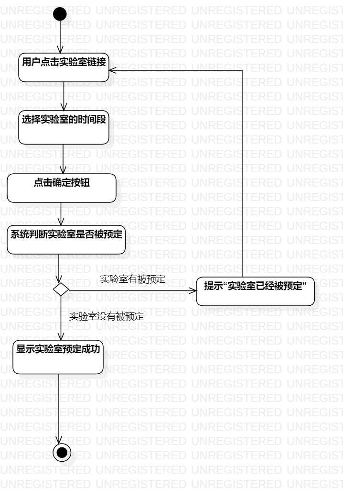

# 实验三：过程建模  

## 一、实验目标

#### 1.学习并掌握过程建模

#### 2. 掌握活动图的绘制  

## 二、实验内容  

#### 1. 学习过程建模
#### 2. 根据用例规约绘制相应的活动图；  

## 三、 实验步骤

#### 1. 通过观看视频学习如何使用UML过程建模
#### 2. 创建活动图
#### 3. 添加Initial和Final节点
#### 4. 根据用例规约来添加Action结点和Decision节点
#### 5. 最后再利用Control Flow将各节点连接起来
#### 6. 保存到指定路径，git push提交

## 四、 实验结果  
#### 图1：录入信息图

#### 图2：预定实验室图

## 五、实验总结
  通过这个实验对于功能的理解更加深刻了，对于github的使用也更加熟练。
  通过老师的讲解，我对于建模的理解更加深刻。
