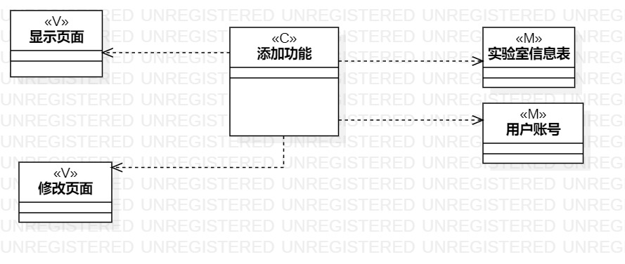
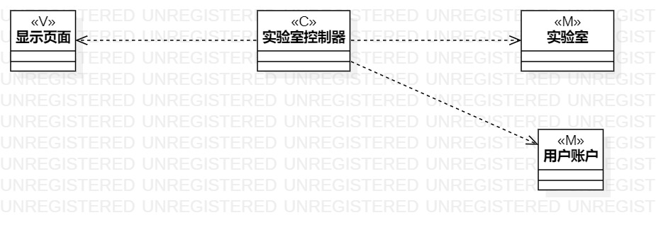

# 实验四：类建模
# 实验五: 高级类建模

## 一、实验目标

#### 1. 掌握类建模方法；
#### 2. 了解MVC或你熟悉的设计模式；
#### 3. 掌握类图的画法。（Class Diagram）

## 二、实验内容  

#### 1. 学习类建模
#### 2. 根据用例规约找出类对象，并且对类建模；  

## 三、 实验步骤

#### 1. 通过观看视频学习如何使用UML类建模
#### 2. 了解MVC模式
#### 3. 创建UML图
#### 4. 根据用例规约来创建类
###### 4.1 使用class来创建类
###### 4.2 在属性中stereotype写下MVC模式中类别
#### 5. 利用Dependency将控制类（C）与模板类（M）和显示类（V）连接起来
#### 6. 保存到指定路径，git push提交

## 四、 实验结果  
#### 图1：录入信息图

#### 图2：预定实验室图

## 五、实验总结
  通过这个实验对于类的理解更加深刻了，并且对于将功能划分成一个一个类的理解更加深刻，
