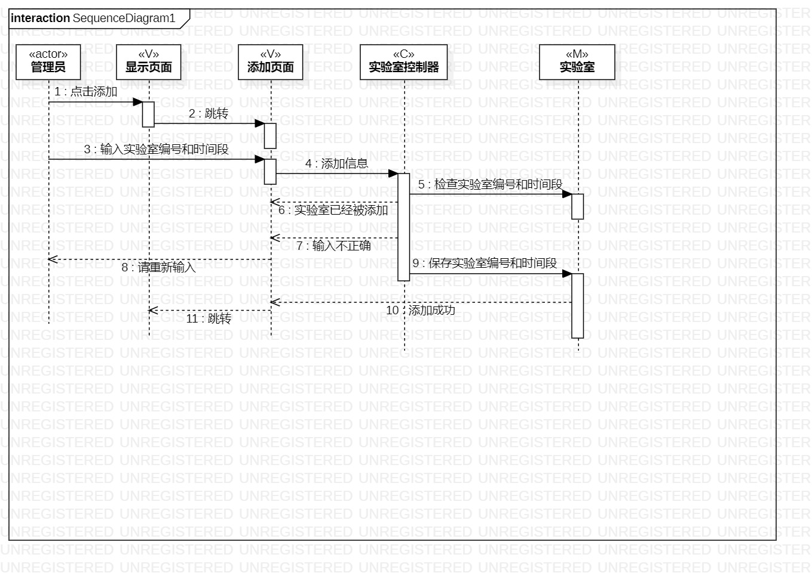
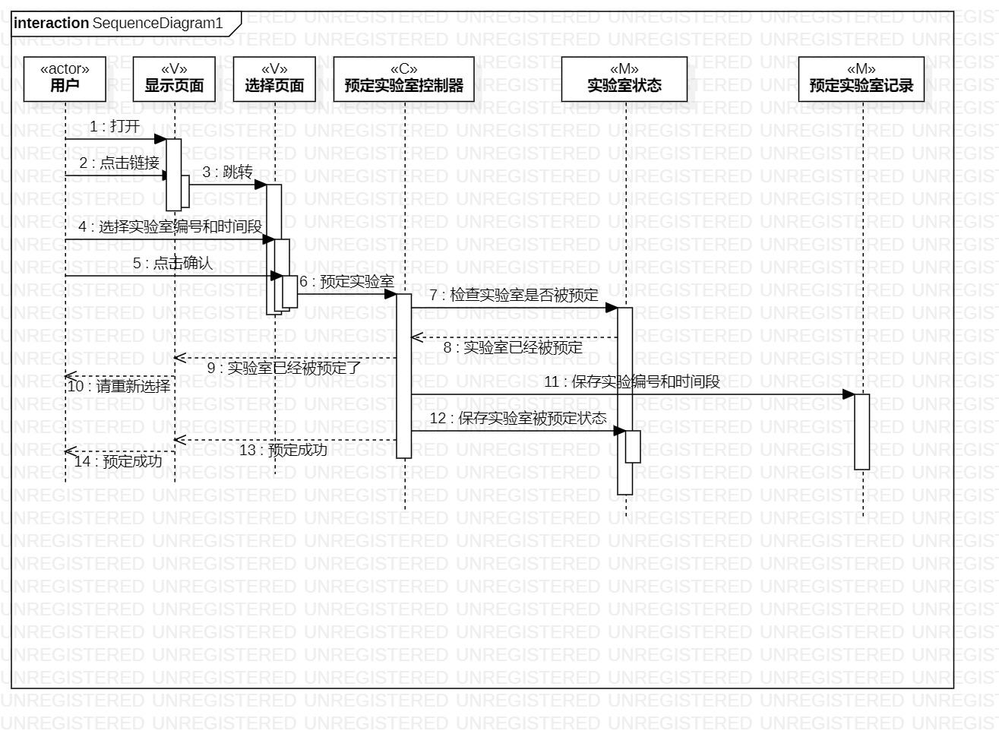

# 实验六：交互建模

## 一、实验目标

#### 1. 理解系统互动；
#### 2. 掌握UML顺序图的画法；
#### 3. 掌握对象互动的定义与建模方法。

## 二、实验内容  

#### 1. 根据用例模型和类模型，确定功能所涉及的系统对象；
#### 2. 在顺序图上画出参与者（对象）；
#### 3. 在顺序图上画出消息（交互） 

## 三、 实验步骤

#### 1. 通过观看视频学习如何使用UML类画图
#### 2. 检查之前的活动图和类建模图
#### 3. 创建UML图
#### 4. 根据用活动图和类建模图来创建顺序图
###### 4.1 使用Lifeline来将类建模图中的类创建
###### 4.2 在根据活动图的活动顺序来使用Message将类之间串联起来
###### 4.3 在根据活动图的活动顺序来使用Reply Message将类之间信息返回
##### 5. 通过创建顺序图将之前的活动图和类图进行修改 
#### 6. 保存到指定路径，git push提交

## 四、 实验结果  
#### 图1：录入信息图

#### 图2：预定实验室图

## 五、实验总结
  通过这个实验对于类的理解更加深刻了，并且对于将功能划分成一个一个类的理解更加深刻，
