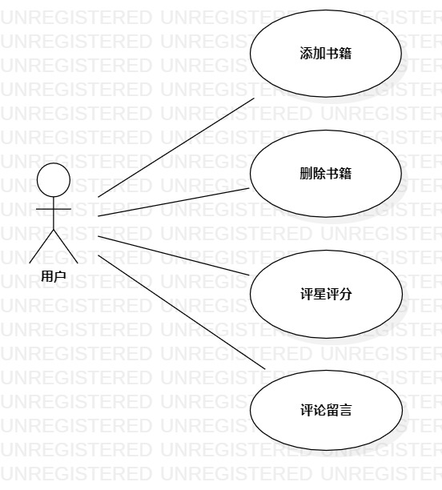

# 实验二：用例建模

## 1.实验目标

- 选题并用例建模
- 使用Markdown写报告

## 2.实验内容

- 选题
- 功能说明。
- 创建用例图
- 编写实验文档

## 3.实验步骤

- 确定题目：书籍评论分享系统
- 功能说明：类似豆瓣读书，用户1可以添加删除书籍，其他用户可以评价讨论用户1分享的书籍
- 根据题目在StartUML上创建用例图，保存到本地（库3）的学号文件夹
- git push到库2
- 编写实验报告，导入用例图
- 把实验报告 git pull到库3
- 提交到库1

## 4.实验结果

图1：书籍评论分享系统用例图
