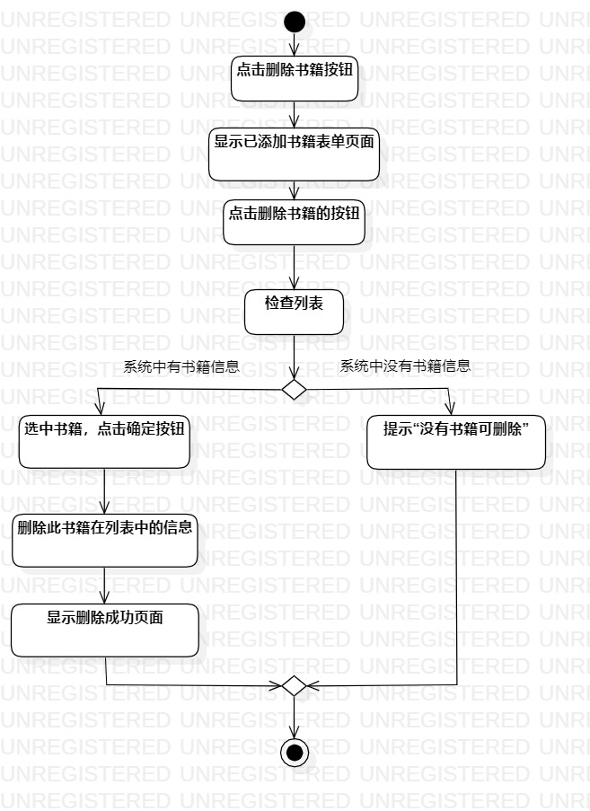
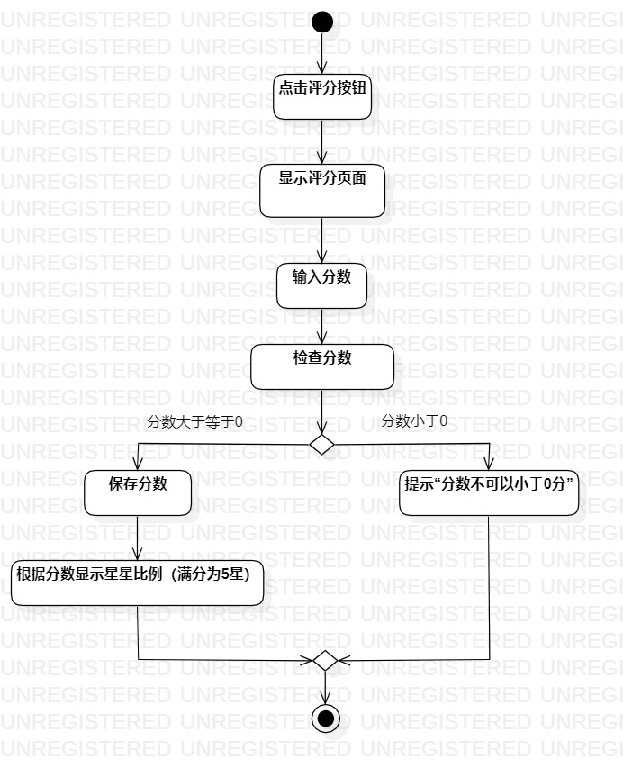

# 实验三：过程建模

 ## 一、实验目标
 1. 掌握过程建模方法；
 2. 掌握活动图（Activity Diagram）的画法。
 ## 二、实验内容
 1. 使用StarUML编写实验二的用例规约画活动图
 - 添加书籍
 - 删除书籍
 - 评分
 ## 三、实验步骤
 1. 在model中新建三个Activity Diagram；
 2. 按照实验二用例图，绘制“添加书籍”、“删除书籍”、“评分”三个用例的活动图；
 3. 检查是否与用例规约中的流程相匹配；
 4. 编写报告并提交。
 ## 四、实验结果
   
 添加书籍的活动图  
   
 删除书籍的活动图  
   
 评分的活动图  
