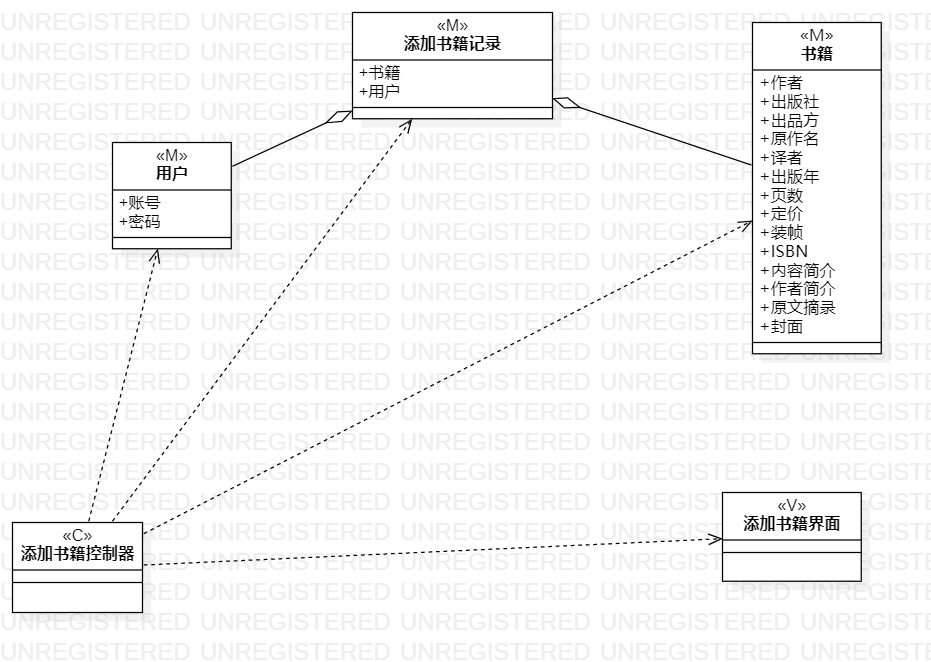
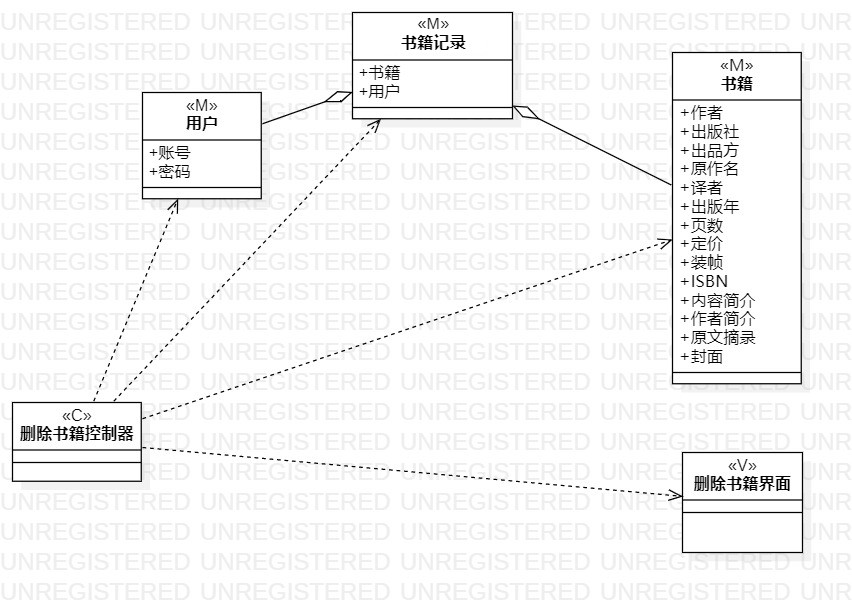
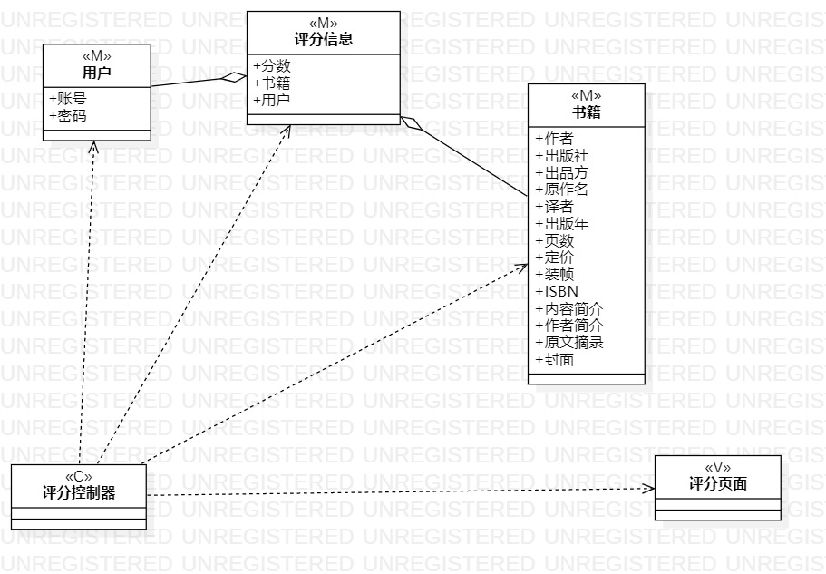

# 实验四、五：类建模

 ## 一、 实验目标

 1. 掌握类建模方法；
 2. 了解MVC设计模式；
 3. 掌握类图（Class Diagram）的画法。

 ## 二、 实验内容

 - 了解并熟悉MVC模式
 - 根据实验二的用例规约，画出类图
 - 理解类的5种关系
 - 熟悉类图的画法

 ## 三、 实验步骤

 1. 依据之前的实验用例创建类图
 2. 采用MVC模式
 - Model 模型 实体 数据
 - View 视图 界面 UI
 - Controller 控制器 服务类 系统  
 3. 类的画法
 - 类=名称+属性+操作（属性和操作可选）
 4. 表述清楚各个类之间的关系
 5.编写实验报告

 ## 四、 实验结果
     
 添加书籍类图   
     
 删除书籍类图  
    
 评分类图  
