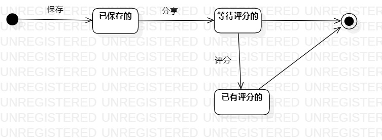

# 实验七：状态建模 

## 1.实验目的
   1.理解状态建模  
   2.掌握UML状态图的画法  
   3.掌握状态之间的转变。

## 2.实验内容
   1.找出书籍分享评分系统中最重要的对象  
   2.在状态图上画出对象的所有状态  
   3.在状态图上画出状态之间的转变以及转变的条件。

## 3.实验步骤
   1. 找出系统中最重要的对象——书籍
   2. 在状态图上画出对象的三个状态：
   - 已保存的：即用户添加了书籍
   - 等待评分的：即用户分享了书籍，但书籍还没有分数
   - 已有评分的：即用户或其他对此书籍进行了评分
   - 由于删除书籍是把书籍直接在系统中删除的，所以没有状态。
   3. 根据活动图画出状态间的转变以及转变的条件  
## 4.实验结果
     
   图一：书籍的状态图
