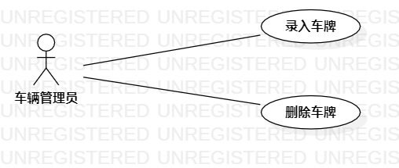

# 实验二：用例建模

## 一、实验目标

- 使用StartUML创建用例图

- 学会规范编写用例规约

## 二、实验内容

- 创建自己的建模选题（在issues中）

- 根据自己的选题用StartUML制作相应的用例图

- 撰写实验报告

- 编写用例规约

## 三、实验步骤

## 1. 在实验库 "https://github.com/hzuapps/uml-modeling-2020" 的Issues中创建自己的建模选题（车辆出入管理系统）

## 2.根据自己的选题在StartUML中绘制用例图

   - 右键点击Untitled选择Add Diagram（添加关系图）添加Use Case Diagram（用例图）
   
   - 在左边选项中分别选取Actor（参与者）以及 Use Case（用例），这里由于我做的是车辆出入管理系统：
   1. 参与者：车辆管理员
   2. 用例：
           录入车牌
           删除车牌
   - 用Association（链接）连接参与者和用例
   
   - 保存图片，打开Git Bash把图片上传到库里（git add，git commit，git push）

## 3.编写用例规约（车辆出入管理系统）

## 四、实验结果

图1.车辆出入管理系统用例图

## 表1：录入车牌用例规约  

用例编号  | UC01 | 备注  
-|:-|-  
用例名称  | 录入车牌  |   
前置条件  |  车辆管理员登录进入车辆管理系统   | *可选*   
后置条件  |                                | *可选*   
基本流程  | 1. 车辆管理员点击录入车牌按钮；  |*用例执行成功的步骤*    
~| 2. 系统显示车牌录入页面；  |   
~| 3. 车辆管理员填写车牌号，点击录入按钮；  |   
~| 4. 系统查询车牌信息，检查未存在相同车牌，把车牌记入待办页并保存该车牌；  |   
~| 5. 系统显示“车牌录入成功”的页面。  |  
扩展流程  | 4.1 系统检查发现车牌号已经存在，提示车辆管理员“该车牌已经存在”。 |*用例执行失败*    

## 表2：删除车牌用例规约  

用例编号  | UC02 | 备注  
-|:-|-  
用例名称  | 删除车牌  |   
前置条件  |  车辆管理员登录进入车辆管理系统   | *可选*   
后置条件  |                                | *可选*   
基本流程  | 1. 车辆管理员点击删除车牌按钮；  |*用例执行成功的步骤*    
~| 2. 系统显示车牌删除页面；  |   
~| 3. 车辆管理员填写车牌号，点击删除按钮；  |   
~| 4. 系统查询车牌信息，检查存在相同车牌，把车牌记为删除状态；  |   
~| 5. 系统显示“车牌删除成功”的页面。  |  
扩展流程  | 4.1 系统检查发现车牌号不存在，提示车辆管理员“该车牌不存在，无法删除”。 |*用例执行失败*   

