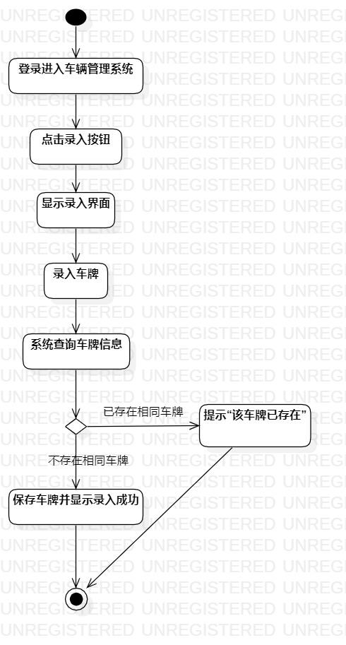
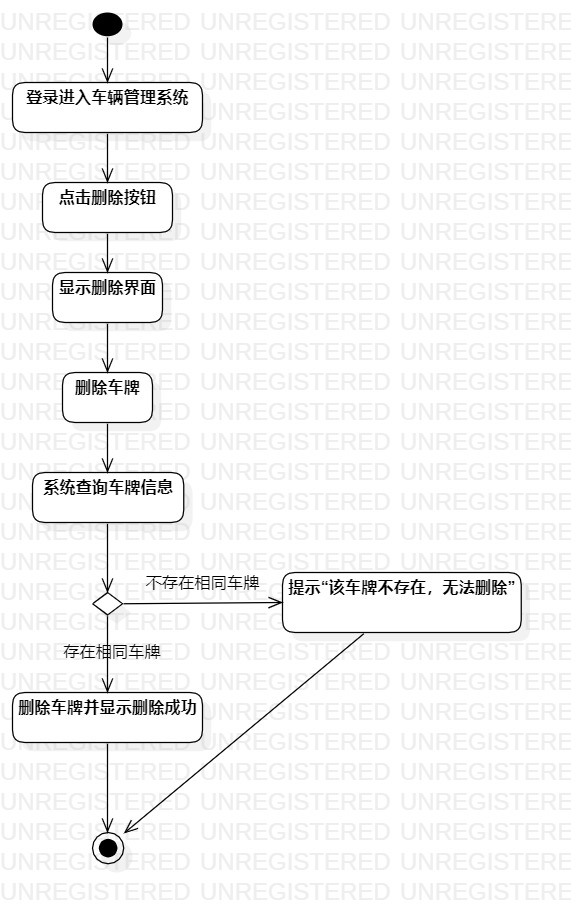

# 实验三

## 1714080902620  梁峻伟
## 一、 实验目标

1. 掌握过程建模方法

2. 掌握活动图的画法（Activity Diagram)

## 二、 实验内容

1.把实验二用例图流程化

2.以用例图为基础画活动图

3.撰写实验报告

## 三、 实验步骤

1.根据用例图来构思活动图的画法
-化简基本流程的操作
-对基本流程和扩展流程进行成功与否条件判断

2.画活动图
-流程写进“Action”中（活动）
-流程之间用“Control Flow”连接（连接线）
-在扩展流程和基本流程的分支处用“Merge"节点注明，同时在连接线注明条件（yes 或 no）
-扩展流程和基本流程产生的不同结果在指向"Final"之前也要用“Merge”汇合

3.完善实验报告

## 四、实验结果

图一：车辆管理系统录入活动图

图二：车辆管理系统删除活动图
