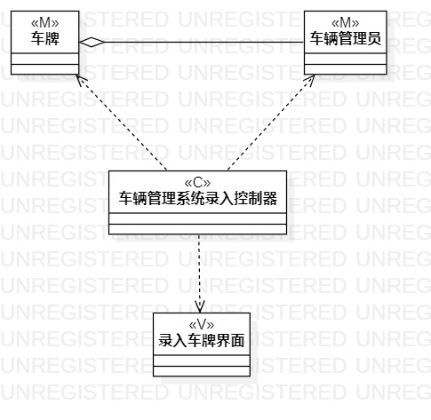
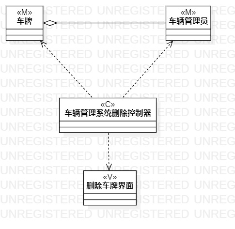

 # 实验四（五）：类建模

 ## 一、实验目标

 - 分析并提取自己做的系统的类，了解类建模过程

 - 利用“MVC”设计模式来进行类建模

 - 掌握类图的画法（Class Diagram)

 ## 二、实验内容

 - 提取车辆管理系统“录入”和“删除”两个功能的类

 - 利用"MVC"建模并画出相应类图（录入类图，删除类图）

 - 撰写实验报告

 ## 三、实验步骤

 ## 1. 根据车辆管理系统用例规约，活动图来提取类。

 - 录入类图的类：车牌，车辆管理员

 - 删除类图的类：车牌，车辆管理员

 ## 2.根据"MVC"设计思路来确定M（Modle模型），V(View视图），C（Control控制器)。

 - 录入类图，M：车牌，车辆管理员，V：录入界面，C：车辆管理系统录入控制器

 - 删除类图，M：车牌，车辆管理员，V：删除界面，C：车辆管理系统删除控制器

 ## 3.根据步骤二确定的M,V,C画类图。

 ## 四、实验结果
 
 图一：车辆管理系统录入类图

 
 图一：车辆管理系统删除类图

