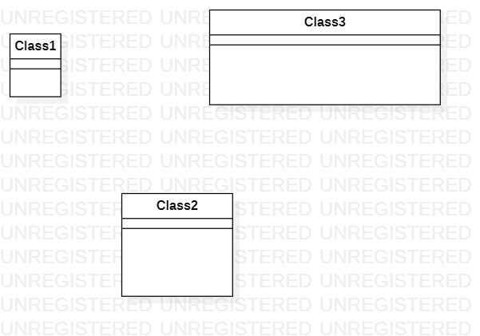

# 实验一

## 1714080902620  梁峻伟
## 一、 实验目标

1. 熟悉GitHub实验过程
2. 安装与使用StartUML

## 二、实验内容

1.安装GitHub并练习使用Git Bash
2.安装StartUML并创建一个图

## 三、实验步骤
1.注册登录GitHub，并且把“https://github.com/hzuapps/uml-modeling-2020”上的数据fork到自己账户

2.按照老师要求的流程
- 把fork的数据执行git clone复制到本地
- 创建自己的学号文件夹，同时在文件夹中用记事本创建相关的md文件，用StartUML创建视图jpg文件。
- 把md，jpg文件上传到自己GitHub账户。（使用git add，git commit，git push）
- 检查自己GitHub上的数据，根据老师的要求做出修改，然后推送到老师创建的库中。
- 用git pull同步自己本地和GitHub的数据
## 四、实验结果
1.画图

图1.在StartUML上创建的第一个图
