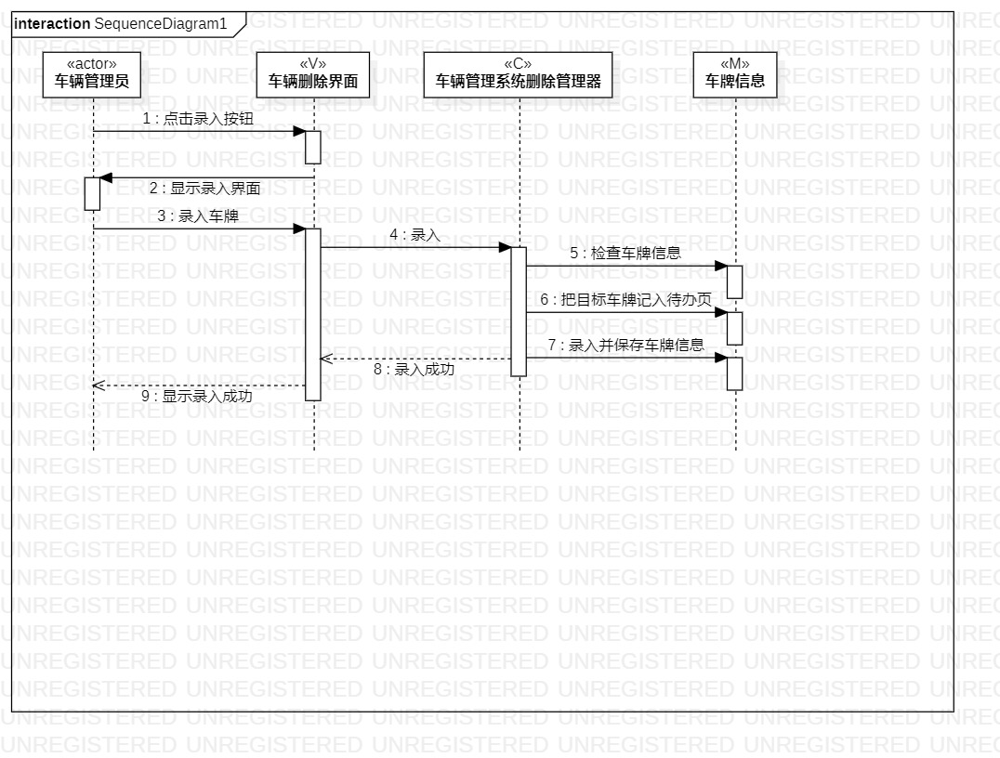
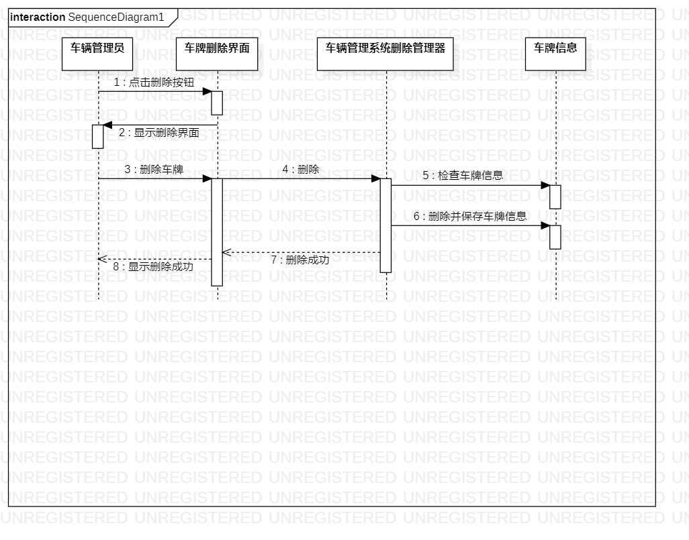

 # 实验六：交互建模

 ## 一、实验目标

 - 理解系统交互；
 
 - 掌握UML顺序图的画法；
 
 - 掌握对象交互的定义与建模方法。

 ## 二、实验内容

 - 根据车辆管理系统用例模型和类模型，确定“录入和删除”所涉及的系统对象；
 
 - 在顺序图上画出参与者（对象）；
 
 - 在顺序图上画出消息（交互）。

 ## 三、实验步骤

 ### 1. 根据车辆管理系统用例图，活动图，类图来提取确定顺序图的参与者（左右方向）

 - 录入顺序图：从左往右依次为车辆管理员，车辆录入界面，车辆管理系统录入管理器，车辆信息
 
 - 删除顺序图：从左往右依次为车辆管理员，车辆删除界面，车辆管理系统删除管理器，车辆信息

 

 ### 2.继续确定交互的内容：（录入和删除基本一样）
  ### message（消息）：1.点击录入（删除）按钮 2.显示录入（删除）界面 3.录入（删除）车牌 4.录入（删除） 5.检查车牌信息 6. 录入（删除）并保存车牌信息
  
  ### reply meassage(返回消息）： 7.录入（删除）成功 8.显示录入（删除）成功

 ### 3.画顺序图

 ## 四、实验结果
 
 图一：录入顺序图
 
 图二：删除顺序图2
