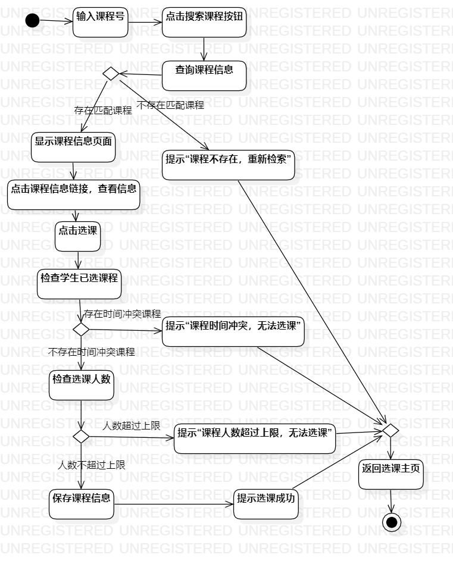

# 实验三： 过程建模

## 一、实验目标

- 1.掌握过程建模方法；
- 2.掌握活动图的画法。（Activity Diagram）

## 二、实验内容

- 1.根据实验2所得用例图，使用StarUML画出活动图
- 2.编写实验报告

## 三、实验步骤
- 1.开设课程
    - 从实验2用例图提炼出步骤操作
    - 添加开始和结束结点；
    - 添加点击添加课程按钮、展示信息录入、输入信息开设课程、查询课程信息这4个无分支流动作
    - 按照用例规约在查询课程信息时会出现分支结点，根据是否存在重复课程将主流程分成两个分支
    - 不存在重复课程分支：保存课程信息，显示开课成功
    - 存在重复课程分支：提示“课程存在，不可重复”
    - 上述分支进行汇聚后，返回开课主页，结束流程

- 2.选择课程
	- 从实验2用例图提炼出步骤操作 
    - 添加开始和结束结点
    - 学生点击选课按钮，检查学生已选课程
    - 检查学生已选课程动作中如果存在时间冲突，提示“课程时间冲突，无法选课”，在分支汇聚节点汇聚后，返回选课主页，结束流程。
    - 检查学习已选课程动作中不存在时间冲突则继续下一个动作，检查选课人数。
    - 检查选课人数会出现两个分支，人数超过上限会有提示“课程人数超过上限，无法选课”的动作，在分支汇聚节点汇聚后，返回选课主页，结束流程
    - 人数不超过上限会继续，保存课程信息、提示选课成功的动作，最后在分支汇聚节点汇聚后，返回选课主页，结束流程

## 四、实验结果

  
图1：开设课程活动图

  
图2：选择课程活动图
