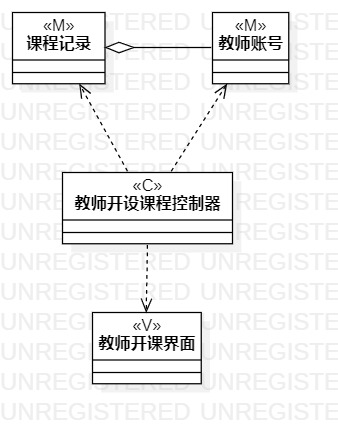
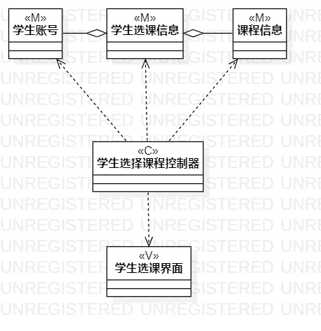

# 实验四类建模
# 实验五高级类建模

## 1.实验目标
- 了解类建模方法
- 了解MVC模式
- 掌握类图的画法
- 理解类的5种关系
- 掌握类之间的画法

## 2.实验内容
- 1.根据用例规约绘制类图。
- 2.编写实验报告。

## 3.实验步骤
- 1.根据用例规约中的基本流程和扩展流程找出相关的类；
- 2.采用MVC的设计模式，来绘制类图；
- 3.确定两个用例分别的控制器；
- 4.根据第一步总结的相关类，分别绘制出两个用例的Model层类；
- 5.根据第一步总结的相关类，分别绘制出两个用例的View层类；
- 6.根据mvc设计模式以及用例规约，在类图中绘制出类的主要关系。

## 5.实验结果

图1：类图1开设课程

图2：类图2选择课程

