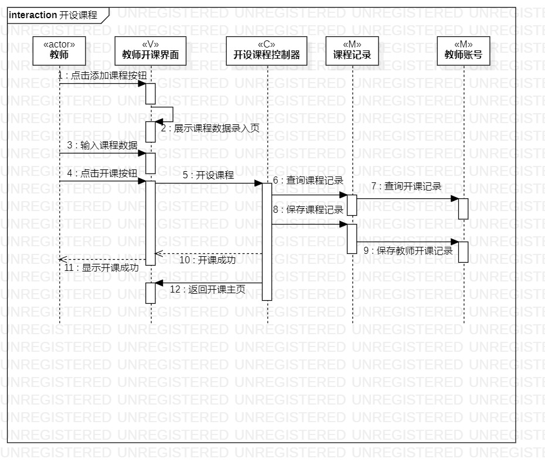
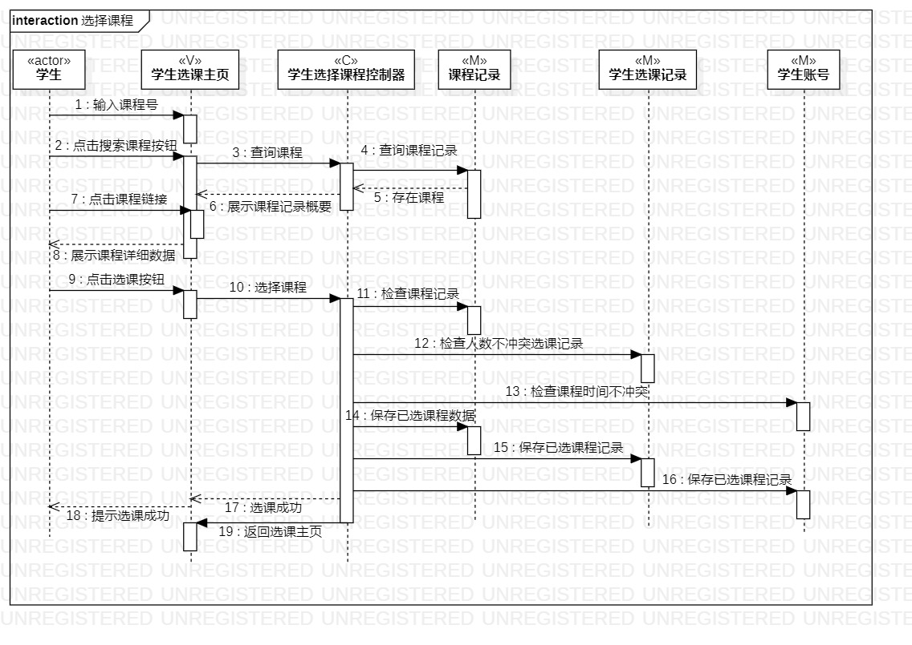

# 实验六：交互建模

## 一、实验目标

- 理解系统交互
- 掌握UML顺序图的画法
- 掌握对象交互的定义与建模方法

## 二、实验内容

- 根据用例模型和类模型，确定功能所涉及的系统对象
- 在顺序图上画出参与者（对象）
- 在顺序图上画出消息（交互）

## 三、实验步骤

- 创建开设课程的顺序图
- 首先查看先前用例规约、用例图和类图，找出1+N个参与者，绘制到交互模型中
- 然后根据活动图提炼操作流程，在顺序图中画出参与者之间的联系
- 最后审查用例规约确认交互流程是匹配活动图
- 创建选择课程的顺序图
- 结合用例规约、用例图和类图，创建1+N个参与者
- 然后同样根据活动图提炼操作流程，在顺序图画出参与者之间的联系
- 最后审查用例规约确认交互流程是匹配活动图

## 实验结果

  
图1：开设课程顺序图

  
图2：选择课程顺序图
