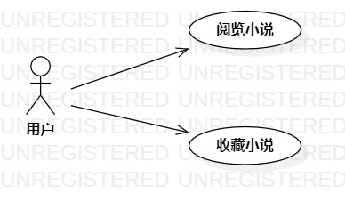

# 实验二：用例建模

## 一、 实验目标

1. 使用Markdown写报告
2. 选题并建模
3. 掌握用例图的画法

## 二、 实验内容

1. 建立个人选题并划分功能
2. 为所选系统功能建立用例图
3. 为所选系统功能建立用例规约
4. 提交实验二报告

## 三、 实验步骤  

1. 确定选题，并写出相关功能

   - 阅览小说
   - 收藏小说

2. 根据功能画出相关Use Case图
3. 根据功能制出用例规约
4. 提交实验2

## 四、 实验结果

1. 画图  
  
图1. 小说用例图

## 表1：阅览小说用例规约 

用例编号  | UC01 | 备注  
-|:-|-  
用例名称  | 阅览小说  |
前置条件  | 用户已登录，用户进入系统  | *可选*   
后置条件  |      | *可选*   
基本流程  | 1. 用户点击搜索栏 ；  |*用例执行成功的步骤*    
~| 2. 系统显示搜索页面；  |   
~| 3. 用户输入小说名，点击搜索；  |   
~| 4. 系统检测用户输入不为空，模糊检索小说，显示小说列表；  |   
~| 5. 用户点击小说；  |   
~| 6. 系统检索用户上次阅读到的页面，显示小说内容；  |    
扩展流程  | 4.1 系统检测用户输入为空 **“显示搜索内容不能为空”**；  |*用例执行失败*    
~| 6.1用户已阅读到最后**提示“您已阅读完本小说”**；  |

## 表2：收藏小说用例规约  

用例编号  | UC02 | 备注  
-|:-|-  
用例名称  | 收藏小说  |   
前置条件  | 用户已登录，系统显示小说列表  | *可选*   
后置条件  |     | *可选*   
基本流程  | 1. 用户长按小说 ；  |*用例执行成功的步骤*     
~| 2.系统显示弹出菜单 ；  |   
~| 3.用户点击收藏小说 ；  |  
~| 4. 系统检测是否含有用户收藏小说的记录，新增一条该用户的收藏记录(包含小说信息与用户信息)，**提示“已收藏”**；  |
扩展流程  | 4.1 系统检测到含有用户收藏小说的记录**提示“请勿重复收藏”**；  |*用例执行失败*    
