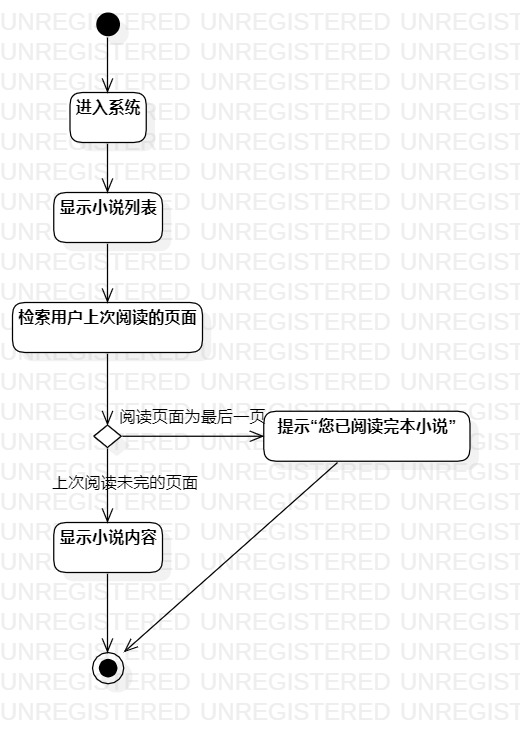
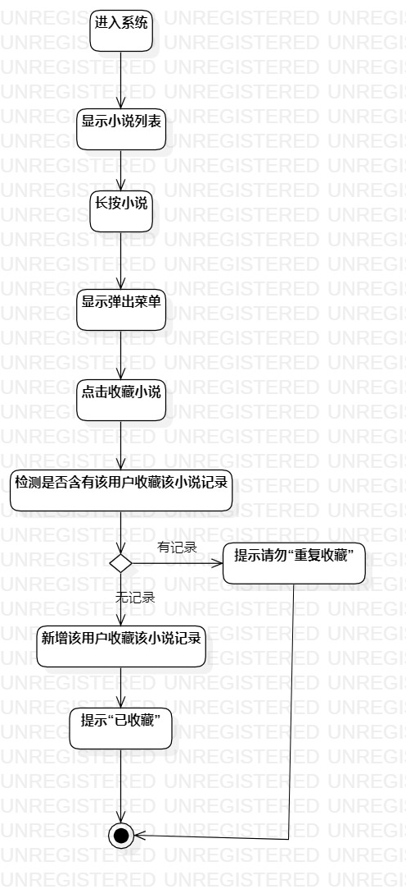

# 实验三：过程建模

## 一、 实验目标

1. 掌握过程建模的方法
2. 掌握活动图的画法

## 二、 实验内容

- 根据实验二的用例规约，画出活动图
- 完善实验二中的用例规约

## 三、 实验步骤

1. 查看实验二所写的用例规约。
2. 在StarUML上作图
- 先画出开始和结束节点

- 根据用例规约画出每一步的操作，确定决策点

- 连线
3. 修改实验二中的用例规约
4. 提交活动图和编写实验文档

## 四、 实验结果

1. 活动图

  
图1. 活动图1  
  
图2. 活动图2  
