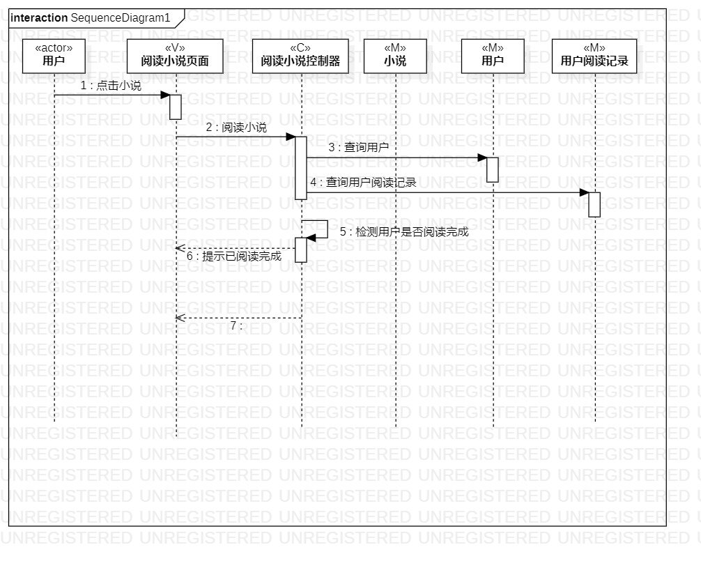
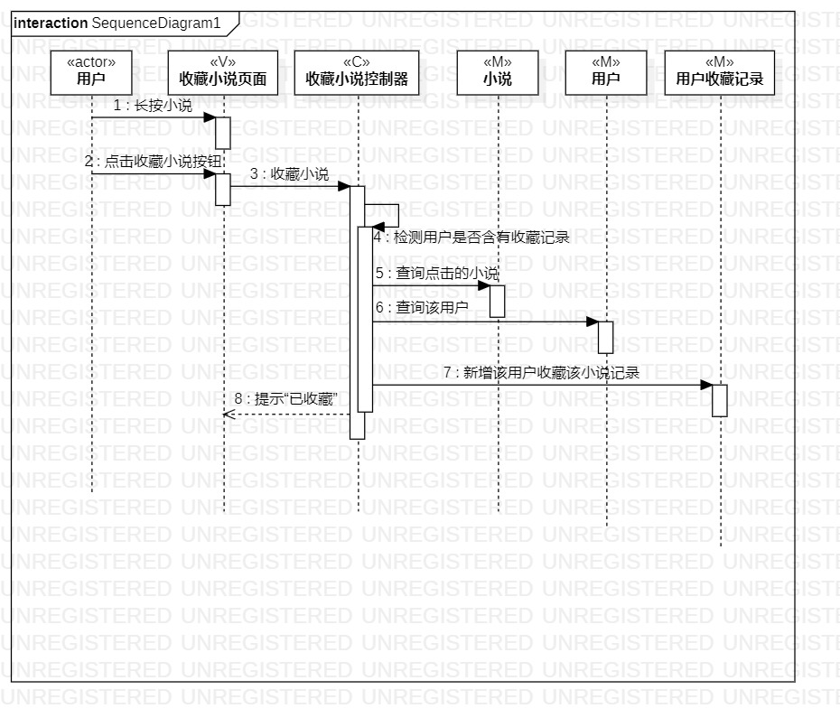

# 实验六

## 一、 实验目标

1. 理解系统交互；
2. 掌握UML顺序图的画法；
3. 掌握对象交互的定义与建模方法。

## 二、 实验内容

1. 根据用例模型和类模型，确定功能所涉及的系统对象；
2. 在顺序图上画出参与者（对象）；
3. 在顺序图上画出消息（交互）。

## 三、 实验步骤

1. 创建顺序图
2. 在用例找到第一个参与者，添加到顺序图
3. 在类图找到其他参与者，添加到顺序图
4. 在活动图找到操作步骤，添加到顺序图并画出参与者之间的关系
5. 提交实验六

## 四、 实验结果

1. 顺序图

  
图1. 顺序图1  
  
图2. 顺序图2  
