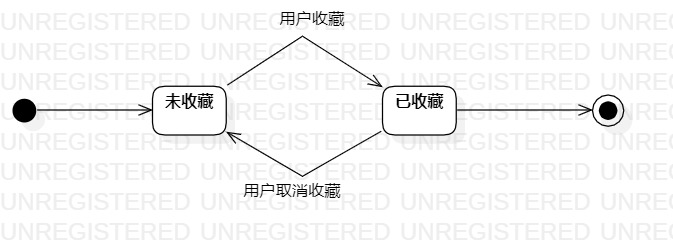

# 实验七：状态建模

## 一，实验目标

1. 掌握状态图及其画法（状态图，Statechart）

## 二，实验内容

1. 寻找1个重要的对象；
2. 寻找这个对象的所有关键状态；
3. 画出状态之间的转换条件。

## 三，实验步骤

1. 寻找一个关键的对象
    - 小说收藏记录
2. 设计该对象的关键状态

    - 与玻璃预约有关的状态：已收藏， 未收藏。

3. 设计状态之间的转变条件

4. 绘制状态图

## 四，实验结果

**图1：玻璃的状态图**