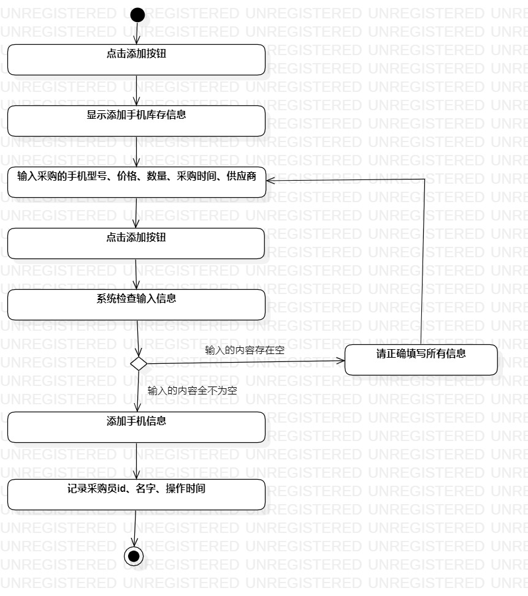

# 实验三 过程建模

## 一、实验目标
	1、掌握过程建模方法
	2、掌握活动图的画法
## 二、实验内容
	1、完善实验二的用例规约
	2、画出实验二用例的活动图
	3、完成实验报告
## 三、实验步骤
	1、修改实验二的用例规约
	2、画活动图
		- 在model下创建一个 Activity Diagrame
		- 选取开始节点
		- 选取结束节点
		- 添加活动
		- 按照用例规约，完成活动图
## 四、实验结果
	
  
图一：采购手机，采购员添加库存信息
  
图二：出售手机，导购员修改库存信息
