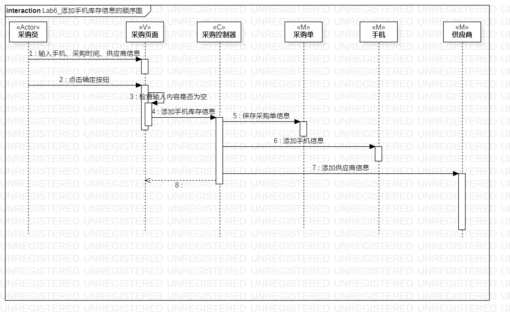
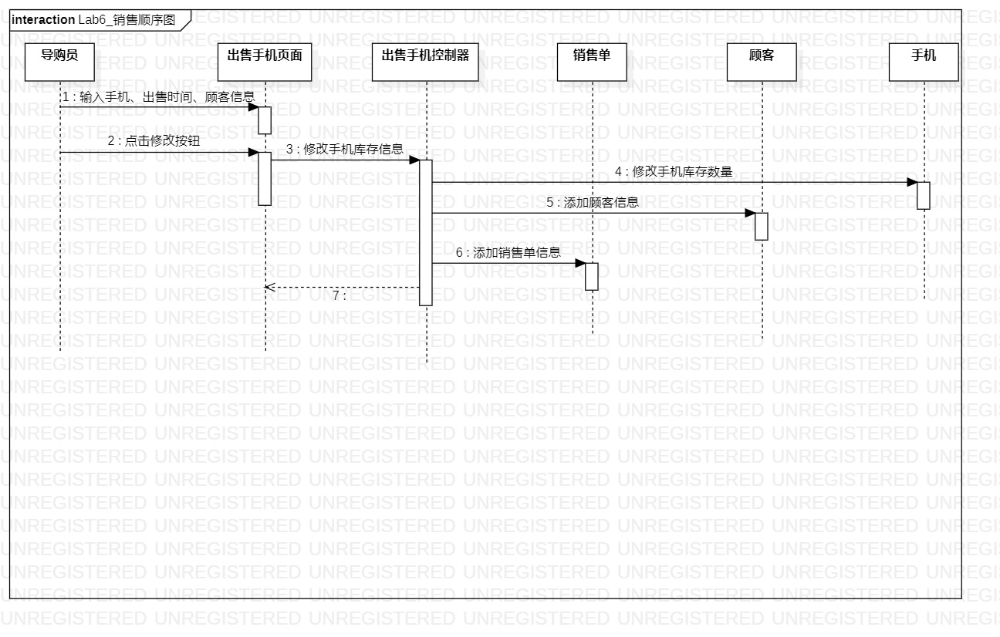

# 实验六 交互建模

## 一、实验目标
	1、理解系统交互；
	2、掌握UML顺序图的画法；
	3、掌握对象交互的定义与建模方法。
## 二、实验内容
	1、根据用例模型和类模型，确定功能所涉及的系统对象；
	2、在顺序图上画出参与者（对象）；
	3、在顺序图上画出消息（交互）。
## 三、实验步骤
	1、画顺序图
		- 从用例图找到第一个参与者（Actor）
		- 标注actor
		- 从类图找到N个参与者（MVC），总共1 + N个参与者
		- 标注MVC
		- 根据活动图的操作步骤，画出参与者之间的信息，标注相应的操作
	2、书写实验报告
## 四、实验结果
	
  
图一：采购手机，采购员添加库存信息
  
图二：出售手机，导购员修改库存信息