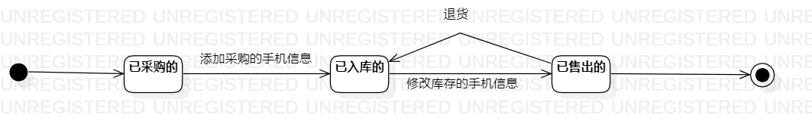

# 实验七 状态建模

## 一、实验目标
	1、理解对象的状态；
	2、掌握UML状态图的画法；
## 二、实验内容
	1、寻找一个重要的对象；
	2、需找这个对象的所有重要的状态；
	3、画出状态之间的转变条件。
## 三、实验步骤
	1、画状态图
		- 添加一个状态图（StageChart）
		- 创建开始和结束的状态
		- 写入手机的三个状态
		- 写入手机状态转变的条件
	2、书写实验报告
## 四、实验结果
	
  
图一：采购手机，销售手机的状态图