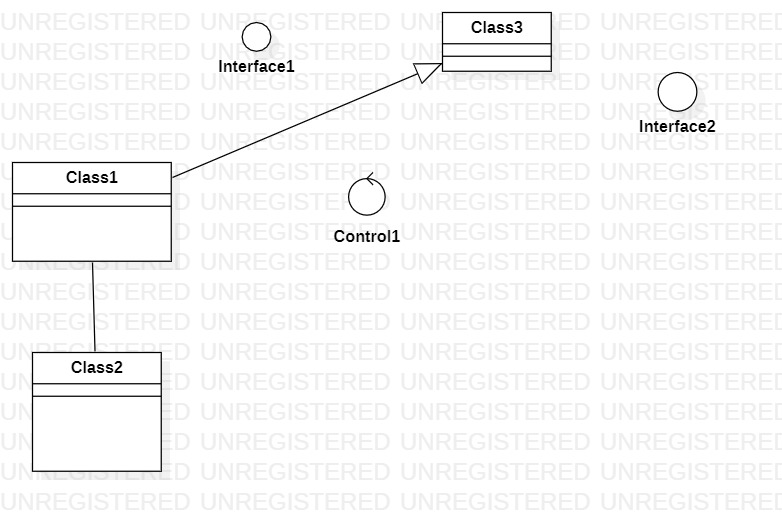

# 实验一

## 一、实验目标

1. 熟悉git实验过程
2. 安装与使用startUML

## 二、实验内容

1. 安装GitHub并练习使用Git Bash
2. 安装StartUML并创建一个图

## 三、实验步骤

1. Fork项目到自己的账号
2. 克隆（git clone）项目到本地
3. 在本地创建学号文件夹以及用StartUML画一个图
4. 将文件提交到Github
5. 发送结果到主库（pull request）

## 实验结果

1. 画图

  
图1：在startUML上创建的第一个图
