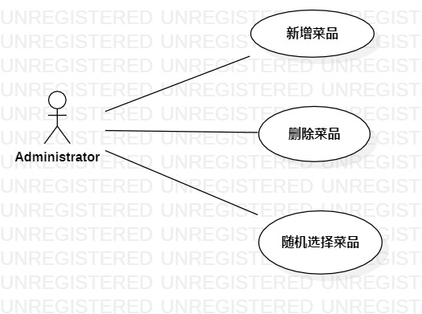

# 实验二：用例建模

## 1. 实验目标

- 使用Markdown写报告
- 选题并用例建模

## 2. 实验内容

- 创建用例图
- 编写实验报告文档

## 3. 实验步骤

- 选题——明天吃点啥系统
- 功能需求：（1）新增菜品；（2）删除菜品；（3）随机选择出一道菜品
- 根据选题，创建用例图
- 添加参与者Administrator和三个用例
- 建立关系Association
- 编写用例规约

## 4. 实验结果

  
图1：今天吃点啥系统的用例图

 
 
## 表1：新增用例规约  

用例编号  | UC01 | 备注  
-|:-|-  
用例名称  | 新增菜品  |   
前置条件  |     | *可选*   
后置条件  |      | *可选*   
基本流程  | 1.管理员点击新增链接；  |*用例执行成功的步骤*    
~| 2.系统显示新增菜品页面；  |   
~| 3.管理员输入菜品名和描述，点击确认按钮；  |   
~| 4.系统查询菜品信息，检查菜品名不存在，保存新增菜品信息；  |   
~| 5.系统提示“添加成功”。  |  
扩展流程  | 4.1系统发现菜品名已存在，提示“添加失败，菜品已存在”。 |*用例执行失败* 

## 表2：删除用例规约  

用例编号  | UC02 | 备注  
-|:-|-  
用例名称  | 删除菜品  |   
前置条件  |      | *可选*   
后置条件  |      | *可选*   
基本流程  | 1.管理员点击删除链接；  |*用例执行成功的步骤*    
~| 2.系统显示删除菜品页面；  |   
~| 3.管理员输入菜品名，点击确认按钮；   |   
~| 4.系统查询菜品信息，检查菜品名存在，删除该菜品名和描述；   |   
~| 5.系统提示“删除成功”。   |   
扩展流程  | 2.1系统发现菜品名不存在，提示“删除失败，该菜品不存在”。  |*用例执行失败* 

## 表3：选择用例规约  

用例编号  | UC03 | 备注  
-|:-|-  
用例名称  | 选择菜品  |   
前置条件  |      | *可选*   
后置条件  |      | *可选*   
基本流程  | 1.管理员点击随机选择菜品按钮；  |*用例执行成功的步骤*    
~| 2.系统计算菜品数量，发现菜品数量大于0；  |   
~| 3.系统根据菜品的添加顺序从1开始编号；   |   
~| 4.系统产生一个1到菜品数量之间的随机数；   |   
~| 5.系统显示随机数对应的菜品名。   |   
扩展流程  | 2.1系统发现菜品数量为0，提示“无菜品选择”。  |*用例执行失败* 
