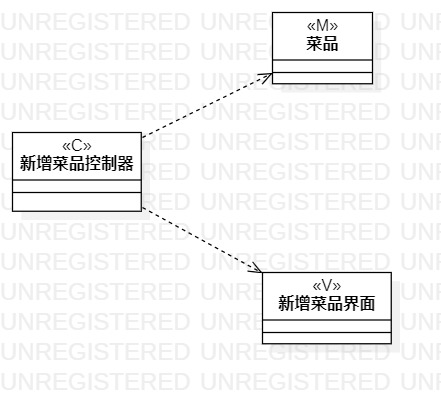
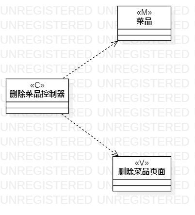

# 实验四：类建模

## 一、实验目标

1. 掌握类建模方法
2. 了解MVC或熟悉的设计模式
3. 掌握类图的画法（Class Diagram）
4. 理解类的5种关系

## 二、实验内容

1. 根据实验二中的用例规约创建类图

## 三、实验步骤

1. 创建上架新菜的类图
2. 首先根据MVC创建三个类，分别是菜品、新增菜品控制器、新增菜品页面
3. 然后给新增菜品控制器类与菜品类、新增菜品页面类添加依赖关系
4. 创建下架菜品的类图
5. 创建三个类，分别是菜品、删除菜品控制器、删除菜品页面
6. 然后给删除菜品控制器类与菜品类、删除菜品页面类添加依赖关系

## 实验结果

  
图1：上架新菜的类图

  
图2：下架菜品的类图

