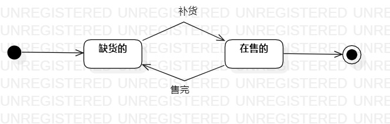

# 实验七：状态建模

## 一、实验目标

1. 掌握对象状态建模（状态图，Statechart）
2. 掌握状态图的画法

## 二、实验内容

1. 学习对象的概念和对象的状态
2. 根据之前的实验画出状态图

## 三、实验步骤

1. 找出系统关键对象——菜品
2. 设计该对象的关键状态——缺货状态，在售状态
3. 添加状态转换条件，通过“补货”将缺货的转为在售的
4. 添加状态转换条件，通过“标记缺货”将在售的转为缺货的

## 实验结果

  
图1：菜品的状态图

