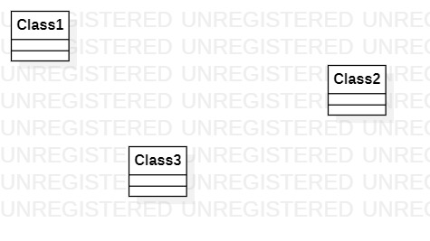

#实验一

##一、实验目标

1、熟悉git实验过程；    
2、安装和使用Staruml。   

##二、实验内容

1、安装git并练习使用git bash，熟悉常用命令；    
2、安装StarUML并创建第一个图。    

##三、实验步骤

1、下载安装软件git和StarUML；      
2、在github上fork项目后，用git bash克隆到本地磁盘；   
3、在本地创建实验文件，用StarUML画第一个图保存到本地，同步到git上；    
4、在github上编辑完善.md文件，并插入图片；  
5、pull request到主项目上。  

##四、实验结果

1、画图  

图1在StarUML上创建的第一个图
