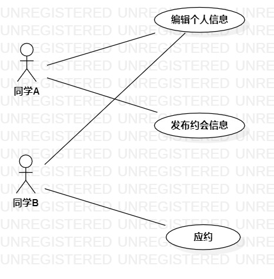

# 实验二：用例建模

##一、实验目标

1、选题；  
2、学习用例建模知识和画图。  

##二、实验内容

1、用StarUML画用例图；  
2、编写用例规约。  

##三、实验步骤

1、确定选题，校园同好约会系统；  
2、根据选题确定参与者是同学；  
3、确定用例是编辑个人信息，发布约会信息，应约；  
4、建立参与者和用例间的联系；  
5、用StarUML画用例图；  
6、编写用例规约。

##四、实验结果

1、画图

图1校园同好约会系统用例图

##表1：编辑个人信息用例规约

用例编号  | UC01 | 备注  
-|:-|-  
用例名称  | 编辑个人信息  |   
前置条件  |  同学进入编辑个人信息页面   | *可选*   
后置条件  |  系统出现信息编辑成功弹框  | *可选*   
基本流程  | 1. 同学点击编辑链接；  |*用例执行成功的步骤*    
~| 2. 系统显示编辑个人信息页面；  |   
~| 3. 同学编辑个人信息，点击保存按钮；  |   
~| 4. 系统检查必填项信息不为空；  |   
~| 5. 系统出现信息编辑成功弹框；  |
~| 6. 系统自动返回首页。  |
扩展流程  | 4.1 系统检查发现信息必填项为空，提示同学“必填项不能为空”；  |*用例执行失败*    

##表2：发布约会信息用例规约

用例编号  | UC02 | 备注  
-|:-|-  
用例名称  | 发布约会信息  |   
前置条件  |  同学进入编辑约会信息页面   | *可选*   
后置条件  |  系统出现约会信息发布成功弹框  | *可选*   
基本流程  | 1. 同学点击编辑约会信息链接；  |*用例执行成功的步骤*    
~| 2. 系统显示编辑约会信息页面；  |   
~| 3. 同学填写约会信息，点击发布按钮；  |   
~| 4. 系统检查必填项信息不为空；  |   
~| 5. 系统出现约会信息发布成功弹框；  |
~| 6. 系统自动返回首页。  |
扩展流程  | 4.1 系统检查发现信息必填项为空，提示同学“必填项不能为空”；  |*用例执行失败*  

##表3：应约用例规约

用例编号  | UC03 | 备注  
-|:-|-  
用例名称  | 应约  |   
前置条件  |  同学进入约会列表页面   | *可选*   
后置条件  |  系统出现应约成功弹框  | *可选*   
基本流程  | 1. 同学点击约会列表链接；  |*用例执行成功的步骤*    
~| 2. 系统显示约会列表页面；  |   
~| 3. 同学点击应约按钮；  |   
~| 4. 同学填写个人信息；  |   
~| 5. 系统检查必填项信息不为空；  |
~| 6. 系统出现应约成功弹框；  |
~| 7. 系统自动返回首页。  |
扩展流程  | 4.1 系统检查发现信息必填项为空，提示同学“必填项不能为空”；  |*用例执行失败*
