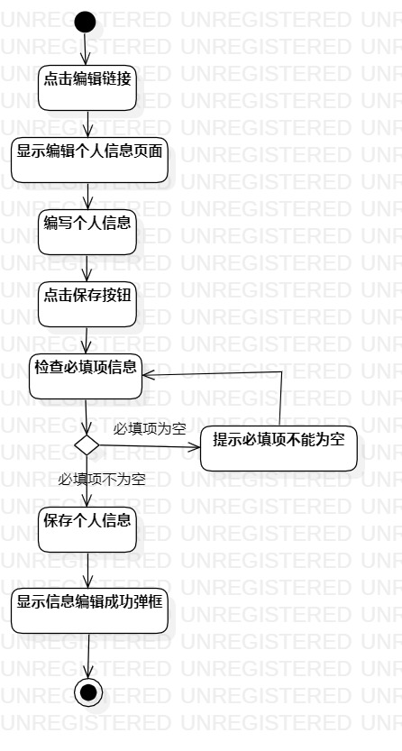
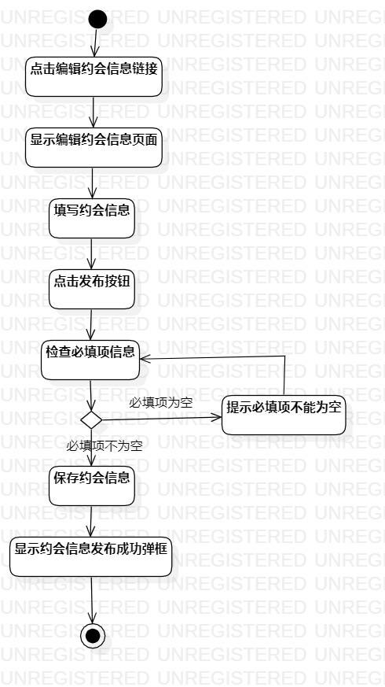
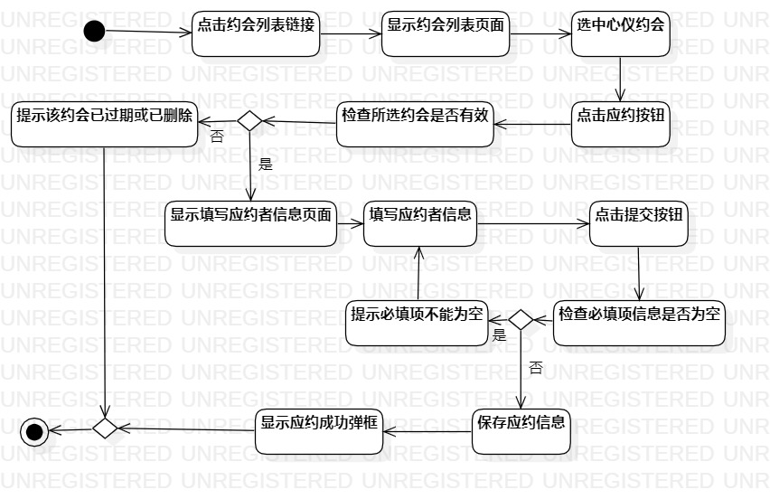

#实验三：过程建模

##一、实验目标

1、掌握过程建模方法；  
2、掌握活动图的画法。

##二、实验内容

1、根据用例规约绘制活动图。

##三、实验步骤

1、添加开始(Initial)节点；  
2、添加结束(Final)节点；  
3、根据用例规约添加操作（Action）；  
4、把基本流程和扩展流程的动作画为操作（Action）节点；  
5、分支的操作之后使用决策（Decision）节点。

##四、实验结果

  
图1 编辑个人信息的活动图

  
图2 发布约会信息的活动图

  
图3 应约的活动图

##五、实验总结

通过这次实验三的学习，基本掌握了过程建模的方法和活动图的画法，在绘制活动图过程中也发现了用例规约的一点不足，进行了改正。

