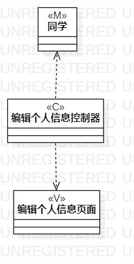
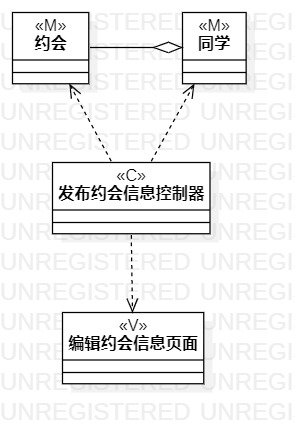
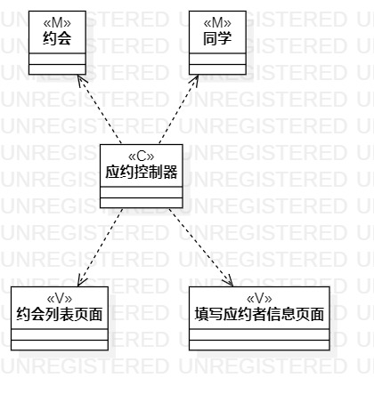

#实验四五：类建模

##一、实验目标

1、掌握类建模方法；    
2、了解MVC或你熟悉的设计模式；   
3、掌握类图的画法。

##二、实验内容

1、基于MVC模式设计类；    
2、设计类的关系；      
3、画出类图。  

##三、实验步骤

1、创建编辑个人信息类图项目；    
2、创建同学类图、编辑个人信息控制器类图和编辑个人信息页面类图，并根据关系用关系线连接；    
3、创建发布约会信息类图项目；    
4、创建约会类图、同学类图、发布约会信息控制器类图和编辑约会信息页面类图，并根据关系用关系线连接；    
5、创建应约类图项目；  
6、创建约会类图、同学类图、应约控制器类图、约会列表页面类图和填写应约者信息类图，并根据关系用关系线连接。  

##四、实验结果

    
图1 编辑个人信息的活动图

    
图2 发布约会信息的活动图

    
图3 应约的活动图

##五、实验总结

通过这次实验四五的学习，基本掌握了类建模的方法和类图的画法，以及MVC设计模式的应用。
