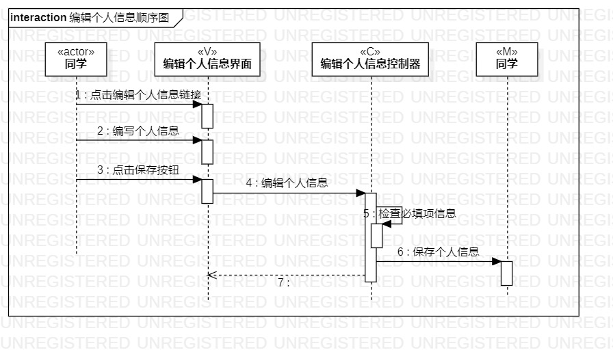
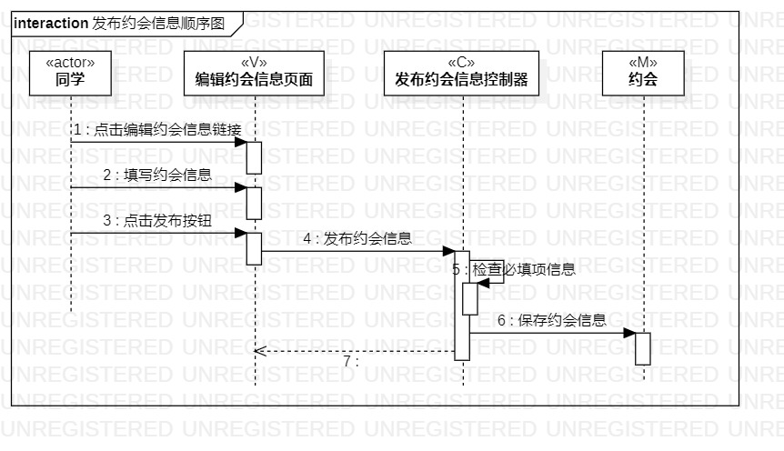
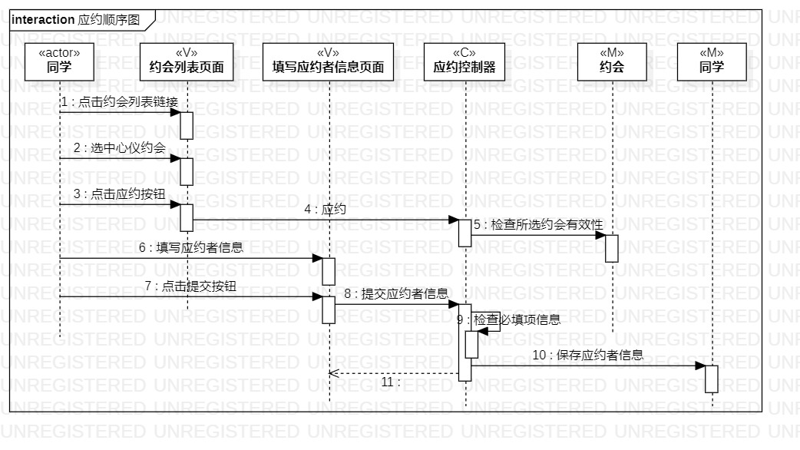

#实验六：交互建模

##一、实验目标

1、理解系统交互；  
2、掌握UML顺序图的画法；  
3、掌握对象交互的定义与建模方法。

##二、实验内容

1、根据用例模型和类模型，确定功能所涉及的系统对象；  
2、在顺序图上画出参与者（对象）；  
3、在顺序图上画出消息（交互）。

##三、实验步骤

1、了解顺序图有关的基本概念和画法；    
2、创建三个顺序图项目（编辑个人信息的顺序图、发布约会信息的顺序图和应约的顺序图）；    
3、根据实验四五的类图确定顺序图的n+1个参与者，包括actor、model、view和control；    
4、根据实验三的活动图和活动的时序关系绘制顺序图；  
5、提交三张顺序图并编写实验报告。

##四、实验结果

   
图1 编辑个人信息的顺序图

   
图2 发布约会信息的顺序图

   
图3 应约的顺序图
