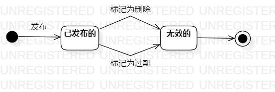

#实验七：状态建模

##一、实验目标

1、掌握对象状态建模（状态图，Statechart）。  

##二、实验内容

1、寻找一个关键的对象；   
2、设计该对象的关键状态；    
3、设计状态之间的转变条件。

##三、实验步骤

1、了解状态图有关的基本概念和画法；    
2、找到一个关键的对象，约会；    
3、设计约会的关键状态，已发布的和无效的；    
4、设计状态间的转变条件，发布、标记为删除或过期；  
5、提交状态图并编写实验报告。

##四、实验结果

   
图1 约会的状态图
