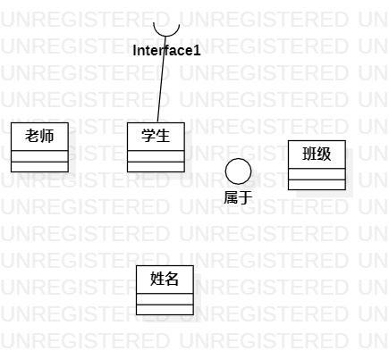

# 实验一

## 一.实验目标
1. 安装 StarUML
2. 安装 GitHub
3. 学会GitHub操作

## 二.实验内容

1. 下载并安装建模工具 StarUML
2. 下载并安装GitHub
3. 熟悉GitHub使用

## 三.实验步骤
1. 下载并安装建模工具 StarUML
2. 下载并安装GitHub
3. 使用StarUML画第一个图
4. 提交实验报告
## 四.实验结果

