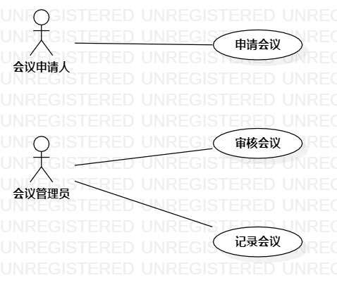

# 实验二：用例建模

## 1. 实验目标

1. 熟悉github使用
2. 学会使用Markdown
3. 理解UML概念
4. 学会StarUML画用例图

## 2. 实验内容

1. 看教学视频学习知识概念和实验步骤
2. 确定选题
3. 画用例图
4. 提交实验二实验报告

## 3. 实验步骤

1. 看老师教学视频
2. 确定选题

　会议管理系统 功能：
- 申请会议资源（会议室、计算机、投影仪等）
- 审核会议（审核通过会议申请）
- 记录会议信息（记录会议当天时间地点人数内容等）
3. StarUML画用例图
4. 用例图提交到个人库
5. 使用Markdown编写实验二实验报告
6. 提交

## 4. 实验结果

图1：会议管理系统用例图
