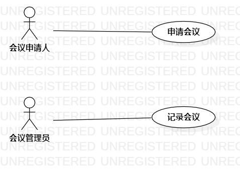

# 实验二：用例建模

## 1. 实验目标

1. 熟悉github使用
2. 理解UML概念
3. 学会StarUML画用例图
4. 学习编写用例规范

## 2. 实验内容

1. 确定选题
2. 画用例图
3. 编写用例规范

## 3. 实验步骤

1. 确定选题

　会议管理系统 功能：
- 申请会议（会议室、计算机、投影仪等）
- 记录会议（记录会议当天时间物资等，编写会议公文）
2. StarUML画用例图
   - 添加Actor:会议申请人、会议管理员
   - 添加UseCase：申请会议、记录会议
   - 建立Actor与UseCase联系
3. 编写用例规范

## 4. 实验结果

图1：会议管理系统用例图

### 表1：申请会议用例规约  

用例编号  | UC01 |   
-|:-|
用例名称  | 申请会议  |   
前置条件  |   会议申请人登录进入会议申请界面；   | 
后置条件  |      |    
基本流程  | 1.会议申请人选择申请开会时间、物资信息;   | 
~| 2.会议申请人点击确定按钮；   |
~| 3.系统查询申请人帐号信息，检查帐号存在；   |  
~| 4.系统查询物资信息，检查物资充足；   |  
~| 5.系统查询会议信息，检查不存在开会时间相冲；   |
~| 6.系统修改物资信息，保存会议申请；   |
~| 7.系统提示“申请成功”；   |
扩展流程  | 3.1系统查询申请人帐号信息，检查帐号不存在，提示“帐号不存在，申请失败！”；   | 
~| 4.1系统查询物资信息，检查物资不充足，提示“物资不充足，申请失败！”；   |
~| 5.1系统查询会议信息，检查存在开会时间相冲，提示“开会时间相冲，申请失败！”；   |  

### 表2：记录会议用例规约  

用例编号  | UC02 | 
-|:-|  
用例名称  | 记录会议  |   
前置条件  |   会议管理员登录进入会议记录界面；   |    
后置条件  |      | *可选*   
基本流程  | 1.会议管理员选择当天开会时间，填写会议纪要公文；   |   
~| 2.会议管理员点击确认按钮；  | 
~| 3.系统查询管理员帐号信息，检查帐号存在；   | 
~| 4.系统查询会议信息，检查会议时间与已申请开会时间相匹配，保存记录信息；   |
~| 5.系统提示“会议记录保存成功”；   |
扩展流程  | 3.1系统查询管理员帐号信息，检查帐号不存在，提示“帐号不存在，保存失败”；   |
~| 4.1系统查询会议信息，检查会议时间与已申请开会时间不匹配；   |    
~| 4.2系统提示“时间不匹配，记录保存失败”；  |  
