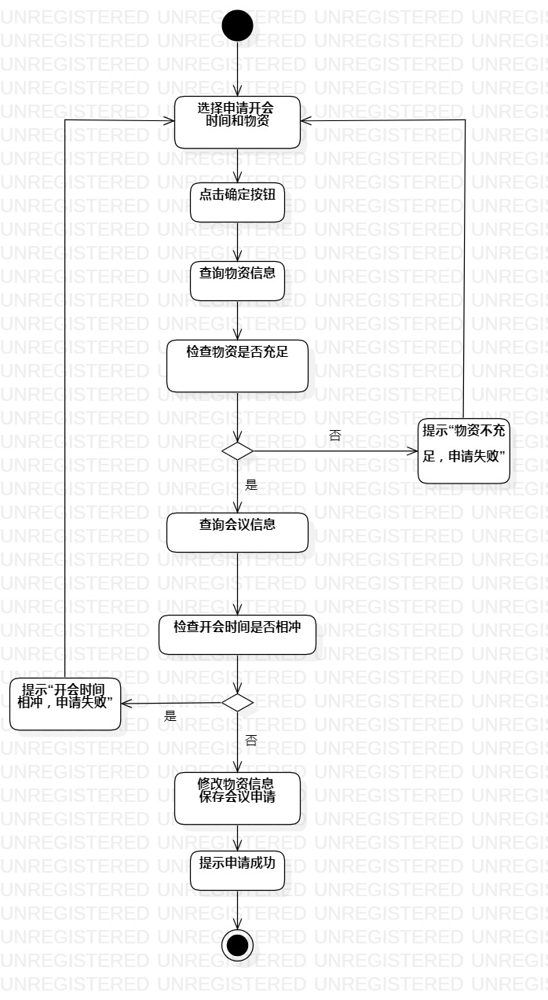
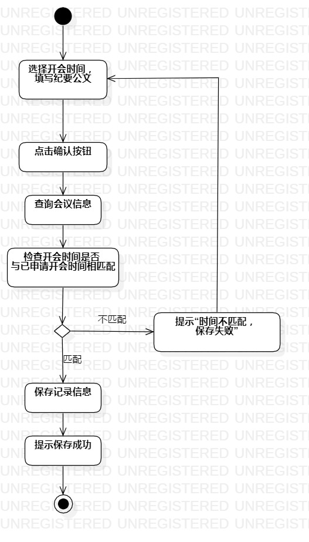

# 实验三：过程建模

## 1. 实验目标

1. 掌握过程建模方法
2. 掌握活动图画法

## 2. 实验内容

1. 学习活动图画法
2. 画用例1活动图
3. 画用例2活动图

## 3. 实验步骤

1. 打开StarUML model新建Activity diagram
2. StarUML画活动图
   - 添加Initial
   - 按基本流程添加Action
   - 添加Decision
   - 按基本流程和扩展流程添加Action
   - 添加Final
   - 建立Control Flow
   
3. git push到个人库
4. 写实验三报告

## 4. 实验结果

图1：申请会议活动图

图2：记录会议活动图

## 5. 实验总结
- 画图要工整，注意主线
- 查询操作不能产生两个结果
- 合并示个人设计定
