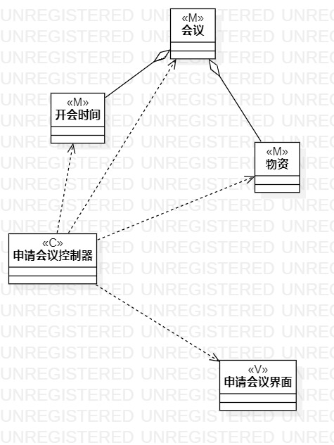
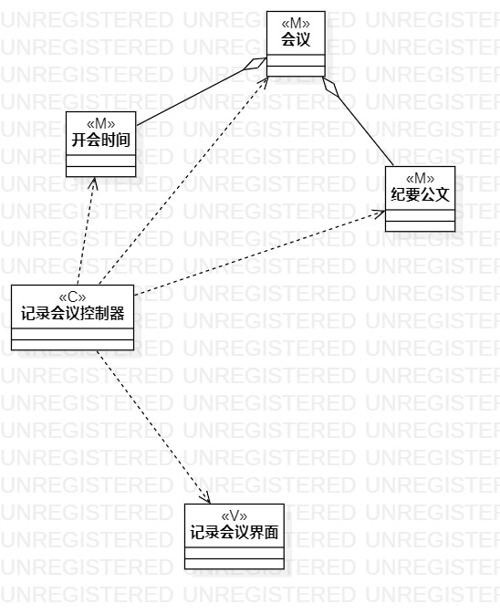

# 实验四五：类建模

## 1. 实验目标

1. 了解类图概念
2. 了解MVC模式
3. 掌握类图画法
4. 了解UML类图的5种关系
5. 掌握类建模方法

## 2. 实验内容

1. 学习类图概念
   - 类与类
   - 类与关系
2. 学习类图画法
3. 画用例1类图
4. 画用例2类图

## 3. 实验步骤

1. 根据MVC模式观察用例的模式（数据）、视图、控制器（系统）
2. 打开StarUML model新建Class diagram
3. StarUML画类图
   - 按模型添加Class
   - 添加控制器Class
   - 添加界面Class
   - 按MVC模式建立Dependency
   - 建立Aggregation
   
4. git push到个人库
5. 写lab4.md

## 4. 实验结果

图1：申请会议类图

图2：记录会议类图

## 5. 实验总结
1. MVC设计模式
  - Model模型：存取数据的实体对象；
  - View视图：数据可视化；
  - Controller控制器：作用于模型与视图，它使模型与视图分开；
2. 类图的5种关系（由弱到强）
  - 依赖（Dependency）：一种使用关系；
  - 关联(Association)：一种拥有的关，它使一个类知道另一个类的属性和方法；
  - 聚合(Aggregation)：整体与部分的关系，部分可离开整体单独存在；
  - 组合(Composition)：整体与部分的关系，部分不能离开整体单独存在；
  - 继承(Inheritance)：一种继承关系，表示父类与子类的关系；
3. 类：属性与操作
