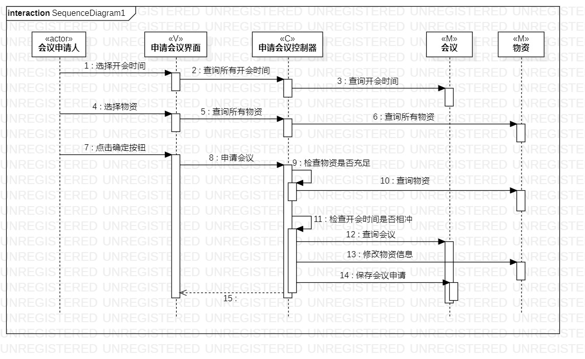

# 实验六：交互建模

## 1. 实验目标

1. 理解系统交互
2. 了解交互建模和顺序图概念
3. 掌握UML顺序图的画法
4. 掌握交互建模方法

## 2. 实验内容

1. 学习交互建模和顺序图概念
   - 对象
   - 顺序图
2. 学习顺序图画法
3. 画用例1顺序图
4. 画用例2顺序图

## 3. 实验步骤

1. 根据用例模型和类模型，确定功能所涉及的系统对象
2. 打开StarUML model新建Sequence diagram
3. StarUML画顺序图
   - 按对象添加Lifeline
   - 按活动图添加Message
   - 建立Reply Message
   
4. git push到个人库
5. 写lab6.md

## 4. 实验结果

图1：申请会议顺序图

图2：记录会议顺序图

## 5. 实验总结
1. 顺序图
  - 参与者；
  - 事件=信号=消息；
  - 存活条；
  - 时间顺序-从上到下；
  - 时间顺序不表示时间跨度； 
2. Message
  - A Synchronous Message 同步
  - An Asynchronous Message 异步
