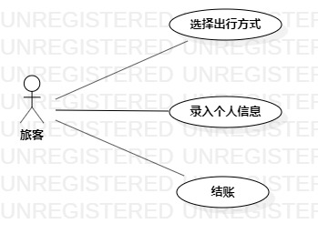

# 实验二：用例建模

## 1.实验目的
- 1.根据功能画出用例图

## 2.实验内容
- 1.细化功能需求。
- 2.画出用例图（Use Case Diagram）。
- 3.编写用例规约（表格）。

## 3.实验步骤
- 1.根据功能确定用例，画出用例图
- 2.保存用例图，上传到自己的个人库
- 3.编辑实验报告
- 4.提交到主库

## 4.实验结果

图1：自动售票系统的用例图
