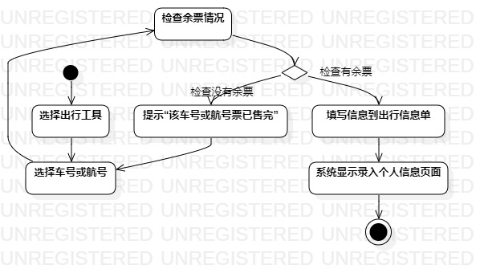
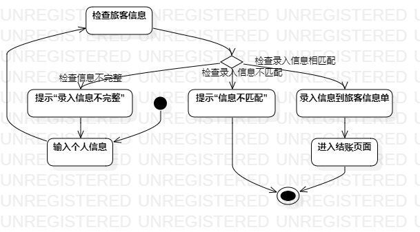
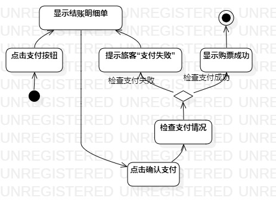

# 实验三：过程建模

## 1.实验目的
1. 掌握活动图的画法。（Activity Diagram）

## 2.实验内容
1. 查看选题的用例规约
2. 根据用例规约画用例的活动图

## 3.实验步骤
1. 查看选题的用例规约
2. 把用例规约中的流程画成对应的UML图的Action
3. 用Control Flow把initial、Action、Decision、Merge、Final连起来

## 4.实验结果

图一：填写出行信息的活动图.jpg

图二：录入个人信息的活动图

图三：结账的活动图
